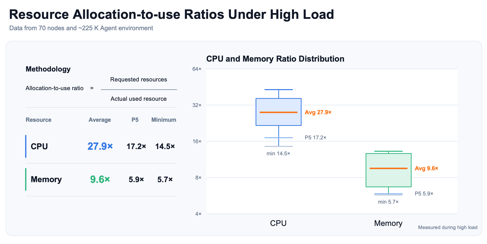
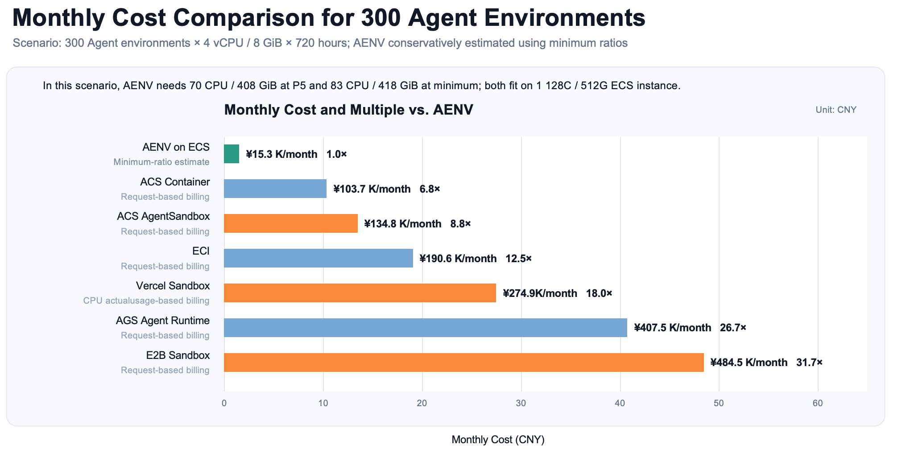

Today, Tsinghua University's MADSys Lab and Moonshot AI are jointly open-sourcing AgentENV (AENV), an agent execution environment for large-scale Agentic RL. Under typical workloads, AgentENV reduces the cost of agent execution environments by 88.6%–96.8%. AgentENV is already being used for the Agentic RL training of several advanced models, including **Kimi K3**.

**GitHub:** [https://github.com/kvcache-ai/AgentENV](https://github.com/kvcache-ai/AgentENV)

## Agentic RL Is Changing How LLMs Are Trained

As LLM capabilities continue to improve, the industry's focus is gradually shifting from "Can the model answer questions?" to "Can the model actually complete tasks?" A capable agent must not only understand user needs, but also operate autonomously. It must plan its steps, call tools, run code, use software, and identify problems and adjust its strategy after failures. Agent capabilities are becoming one of the key measures of the practical value of next-generation LLMs.

To give LLMs these capabilities, reading text and imitating answers is no longer enough. They must also complete tasks repeatedly in real or simulated environments and learn from each attempt. This is Agentic RL: the system continually assigns tasks to an agent, such as writing and running code, using software, or searching for and summarizing information. The agent plans its own steps, calls tools, and completes the task. The system then provides feedback based on whether the task succeeded and whether the process was reasonable, and updates the LLM's weights through reinforcement learning. After extensive training, the model can gradually develop more reliable planning, decision-making, and tool-use capabilities, moving from "answering questions" to truly "completing tasks."

## Agentic RL Needs New Infrastructure

Unlike traditional reinforcement learning, Agentic RL is no longer about calculating rewards inside a Python function or static simulator. Today's coding agents, computer-use agents, and general-purpose agents need to read code, modify files, install dependencies, start services, and interact with databases or external systems in real software environments. This means every training run requires a real, complete, and independent execution environment.

The infrastructure supporting these environments must provide **strong isolation, scalability, and high efficiency**: give each agent an independent security boundary so it cannot affect the host or other training tasks; horizontally scale concurrent execution while efficiently managing a growing collection of images and environment templates; and support thousands or even tens of thousands of concurrent environments at an acceptable cost.

In our research, we found that reward-driven agents may attempt to break out of execution boundaries, access hidden services, modify evaluation logic, or even retrieve answers from external sources. Although these behaviors may earn higher rewards, they corrupt the training signal. Strong isolation is therefore fundamental to reliable Agentic RL.

Traditional sandboxes typically focus on secure isolation, but often lack the flexibility to support the diverse environment configurations required by agent tasks. Different tasks require different combinations of operating systems, language runtimes, compilers, packages, toolchains, code repositories, and external services. These dependencies must be prepared in advance through images and environment templates. As the number of tasks grows, the required environments quickly become a large and highly diverse image collection whose total size may far exceed the storage capacity of a single node. Agent execution environments must therefore solve not only isolation, but also the challenge of scaling to a massive number of images.

Meanwhile, a typical Agentic RL workload often needs to maintain thousands of stateful environments at the same time. Most of them sit idle while waiting for the model to generate the next action. But if each environment permanently reserves its own CPU, memory, and storage resources, environment costs quickly become a bottleneck to further scaling. Traditional virtual machines struggle to balance isolation, fidelity, and resource efficiency, creating the need for a new generation of agent execution environments.

## Today, We Are Officially Open-Sourcing AgentENV

To address these challenges, we are officially open-sourcing **AgentENV (AENV)**, an agent execution infrastructure platform built for large-scale Agentic RL.

AgentENV uses Firecracker to build strongly isolated microVM execution environments. Through on-demand image loading, incremental snapshots, copy-on-write forks, memory and storage reuse, and elastic lifecycle management, it provides every agent task with a secure, scalable execution environment that can be forked quickly. It prevents agents from interfering with each other while supporting large-scale Agentic RL at higher deployment density and lower resource cost.

In real-world deployments, AgentENV's concurrency capacity depends on the hardware specifications of each node and the resource quotas assigned to its microVMs. Under a typical configuration, such as a server with 128 CPU cores and 512 GB of memory, a single node has been measured to run 400 concurrent agent execution environments reliably, with typical environment specifications of 2 vCPU / 4 GB or 4 vCPU / 8 GB. In production, clusters have successfully scaled to 30,000 agent execution environments and can continue to scale linearly as more nodes are added. Template-based startup or restore latency can be as low as 49 ms, while snapshot creation latency can be as low as 133 ms. In concurrent fan-out scenarios, the amortized fork latency for each immediately executable child environment can be as low as 122 ms. Compared with existing solutions, AgentENV reduces environment lifecycle management overhead by roughly an order of magnitude.

This means that the time-consuming and expensive cycle of "creating an environment, executing a task, saving its state, and restoring or replicating the environment" in Agentic RL can be completed faster and run in parallel at a much larger scale. Researchers and developers can dedicate more compute resources to model training itself instead of spending them on environment management.

AgentENV is already being used for the Agentic RL training of several advanced models, including **Kimi K3**. Today, we are opening up this infrastructure for large-scale Agentic RL to help more teams lower the barrier to Agentic RL and to explore the next generation of agent training paradigms together with the community.

## AgentENV's Core Design

To meet Agentic RL's requirements for **strong isolation, scalability, and high efficiency**, AgentENV redesigns environment management, resource reuse, and state management to make large-scale agent training truly scalable.

### Scaling Heterogeneous Environments Across Nodes

AgentENV can run Firecracker microVMs at scale across multiple servers and is compatible with the OCI image ecosystem. Images are loaded on demand from remote object storage or remote file systems through OverlayBD, while local disks serve only as limited-capacity caches for hot data.

As a result, the total number of images and environment templates available to a cluster can exceed the disk capacity of a single node, without requiring every image to be prewarmed on every host. This is especially important for agent training workloads that involve large numbers of code repositories, dependency versions, and toolchains.

### Making Idle Environments Inexpensive

AgentENV can start or restore snapshot-based environments within tens of milliseconds and pause them within hundreds of milliseconds. While an environment waits for model inference, it can release CPU and reclaimable memory, then quickly resume from its existing state when a new action arrives.

This allows the training system to maintain thousands of logically active, stateful execution environments at a lower cost without continuously reserving full physical resources for all of them.

### Native Support for Incremental Snapshots and Forks

AgentENV incrementally records changes to memory and the file system, eliminating the need to copy an entire virtual machine every time its state is saved. Snapshots can be persisted to S3-compatible object storage or a shared distributed file system, preventing state loss when a node fails.

The same intermediate state can also be forked into multiple independent execution environments using copy-on-write, allowing an agent to try different tool calls, code changes, or operation sequences in parallel. This provides an efficient environment foundation for multi-trajectory sampling and tree search.

### Maintaining High Density Over Time

As microVMs continue to run, each environment gradually accumulates more private state. AgentENV continuously reuses and reclaims storage and memory to prevent deployment density from declining rapidly over time.

On the storage side, the RootFS, base images, tool disks, dependencies, and stable snapshot states are organized as read-only OverlayBD layers and deduplicated through content-addressed caching. Each microVM stores only its own incremental writes. Disk I/O uses ublk, io_uring, and Direct I/O to reduce redundant caching between the virtual machine backend and the host.

On the memory side, execution environments restored from the same template share a read-only memory snapshot. Clean pages are reused through the host's Page Cache, while only dirty/COW pages and active anonymous memory become private allocations. AgentENV also continuously reclaims file cache inside the guest through DAMON Reclaim and Firecracker Balloon, freeing memory resources.

## Turning Resource Sparsity into a Cost Advantage

Agent execution environments in Agentic RL are usually provisioned for peak demand, but they rarely use all of those resources at the same time. We use the "resource allocation-to-usage ratio" to describe this gap:

**Resource allocation-to-usage ratio = total resources allocated to all execution environments ÷ actual resource usage on the host**

We analyzed AgentENV's real-world production data from 70 nodes during high-load periods, covering approximately 225,000 execution environments. The results show that the CPU allocation-to-usage ratio averaged **27.9×**, with a minimum of **14.5×**. The memory allocation-to-usage ratio averaged **9.6×**, with a minimum of **5.7×**.

AgentENV does not achieve these high allocation-to-usage ratios by adding physical resources to each machine. Instead, it makes better use of otherwise idle resources through fast pause and resume, memory reclamation, and state sharing.

Consider **300 agent execution environments, each with 4 vCPU and 8 GB of memory, running continuously for 720 hours**. Based on the lowest observed resource allocation-to-usage ratio, AgentENV's estimated monthly resource cost is approximately **¥15,300**. Using the same CPU and memory request assumptions shown in the chart, solutions that charge by requested resources or rely on long-term resource reservations are estimated to cost **8.8 to 31.7 times** as much as AgentENV. Container instances are excluded from the comparison.

These results are based on specific task workloads, resource prices, and billing models. Actual costs will vary with execution environment activity, memory writes, environment specifications, and cloud platform pricing. Nevertheless, they demonstrate a clear trend: for large numbers of stateful, intermittently active agent execution environments, cost should not be determined by "how many environments were created," but should instead be as close as possible to "how many resources were actually used."

## Open Source, Built Together

As agents evolve from answering single-turn questions to writing code, using software, calling tools, and completing long-horizon tasks, execution environments are becoming critical infrastructure for Agentic RL. Isolation determines whether training is safe and trustworthy, environment fidelity determines whether capabilities can transfer, and lifecycle efficiency and resource density determine whether training can continue to scale.

AgentENV aims to provide an efficient and reliable environment foundation for the next generation of Agentic RL through strong isolation with Firecracker, OCI image compatibility, incremental snapshots and forks, and memory and storage reuse.

We welcome everyone to use AgentENV and look forward to more developers and researchers joining us to build a better AgentENV together.

**GitHub:** [https://github.com/kvcache-ai/AgentENV](https://github.com/kvcache-ai/AgentENV)

## Appendix: Pricing References and Calculation Method

The following unit prices are based on information available on July 26, 2026. All US dollar prices are converted at the Wise mid-market exchange rate on that date of 1 USD = 6.773 CNY. ECS prices vary by region, purchasing method, and discounts; the amounts in the table are quotes from the pricing calculator on that date. Prices for other products are the public rates listed on their official pages.

### Pricing References

| Model | CPU Price | Memory Price | Key Billing Logic |
|---|---|---|---|
| AgentENV on ECS | Bundled in the ECS instance price | Bundled in the ECS instance price | `ecs.g9i.32xlarge`: 128 vCPU / 512 GiB, ¥15,270.53/month, equivalent to approximately ¥0.0707/sandbox-hour in this scenario. |
| ACS Container | ¥0.06 / vCPU-hour | ¥0.03 / GB-hour | Billed based on the sum of the `limits` values for all containers in an ACS Pod. |
| ACS AgentSandbox | ¥0.078 / vCPU-hour | ¥0.039 / GB-hour | Billed based on the vCPU and memory specified and normalized when the sandbox is created. Billed by the second and invoiced hourly; no CPU or memory fees are charged while sleeping. |
| ECI | ¥0.1764 / vCPU-hour | ¥0.0221 / GB-hour | Billed based on the vCPU and memory specified and normalized when the ECI instance is created, rather than actual runtime utilization. Billed by the second and invoiced hourly. |
| AGS Agent Runtime | ¥0.2916 / vCPU-hour | ¥0.09 / GB-hour | Billed based on the number of CPU cores and amount of memory allocated to the sandbox, as well as actual runtime in seconds. Durations under one second are rounded up to one second, with hourly settlement. |
| E2B Sandbox | $0.0504 (approx. ¥0.3414) / vCPU-hour | $0.0162 (approx. ¥0.1097) / GB-hour | Billed by the second based on the wall-clock time of a running sandbox, with CPU and memory charges accumulating throughout its runtime. |
| Vercel Sandbox | $0.128 (approx. ¥0.8669) / vCPU-hour | $0.0212 (approx. ¥0.1436) / GB-hour | CPU is billed based on actual active usage; memory is still billed based on configured capacity and sandbox lifetime. |
