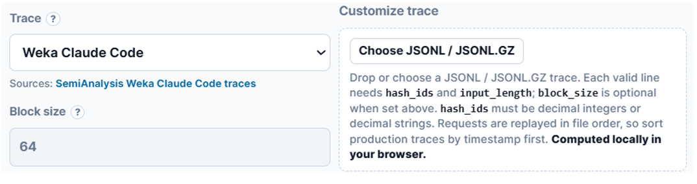
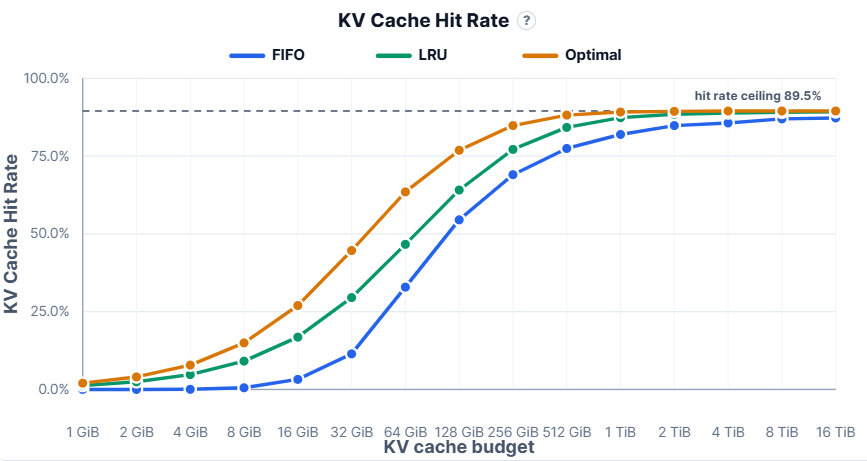
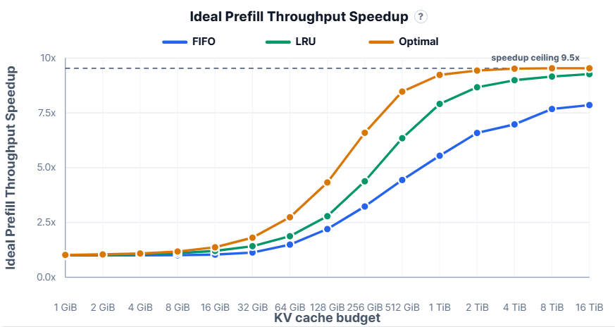

In LLM inference clusters, the storage budget for the KV Cache directly affects the KV Cache hit rate and prefill throughput. If the cache is configured too small, reusable KV entries will be evicted too early. If it is configured too large, valuable storage resources will be wasted. Therefore, the key question in KV Cache capacity planning is: **given a specific workload and model configuration, how much cache space should be allocated to achieve a sufficiently high hit rate and reasonable marginal returns?**

To address this, we have released the **KVCache Hit Rate Simulator**, a tool for simulating KV Cache hit rates. Based on request traces and model parameters, it can calculate the KV Cache hit rate under different KV Cache capacities and further estimate the prefill performance improvement brought by KV Cache reuse. In this article, we will:

- **Introduce how to use this tool to properly configure and optimize KV Cache storage capacity in online inference clusters.**
- **Share some observations and insights from our analysis.**

Tool: https://kvcache.ai/tools/kv-cache-hit-rate-simulator/

## Step 1: Parameter Configuration

The KV Cache hit rate is highly dependent on reuse patterns across requests. Therefore, the first step is to prepare a trace that can represent your online workload. You can use your own local trace or directly select one of the built-in traces provided by the tool.

We have prepared several types of traces in advance, such as Tool Agent, Coding Agent, and RAG. We recommend choosing the trace type that most closely matches your online business scenario.

For local traces, data security is usually the primary concern. KVCache Hit Rate Simulator does not upload user data. Trace parsing and hit-rate simulation are both performed locally in the browser. Since the tool itself is open source, users can also deploy it directly in their own environment to further satisfy internal data security and compliance requirements.

In addition, different models have different KV Cache sizes. Therefore, when running the simulation, you also need to select the corresponding model and precision.

## Step 2: Data Analysis

After the parameters are selected, the tool automatically calculates the relevant metrics. The first thing to examine is the figure showing how the KV Cache hit rate changes as the KV Cache capacity increases.

First, look at the upper bound of the KV Cache hit rate. The horizontal line of **“ceiling”** in the figure represents the theoretically maximum hit rate that the workload can achieve under the assumption of unlimited KV Cache capacity. In other words, it is the theoretical upper bound of the hit rate.

Next, focus on the actual hit rates under different cache budgets. Under the same cache capacity, different cache eviction algorithms may have a significant impact on the hit rate. Since most inference systems currently use the LRU algorithm, **we can mainly focus on the line corresponding to LRU**.

Note: For LRU algorithms based on prefix reuse, eviction naturally starts from the leaf nodes of the radix tree.

In general, we want the hit rate to be as close as possible to the theoretical upper bound. However, when the hit rate approaches this upper bound, the marginal benefit of further increasing KV Cache capacity drops rapidly. Therefore, we need to make a trade-off between storage capacity and compute efficiency.

When making this trade-off, the hit-rate curve alone can be misleading. The same absolute increase in hit rate can translate into very different performance gains depending on the hit-rate range. This is particularly important for today’s agentic workloads, which often have very high KV Cache hit-rate ceilings, typically above 90%.

In the high-hit-rate range, each additional percentage point becomes increasingly valuable. For example, increasing the hit rate from 50% to 55% yields roughly a 10% prefill speedup, while increasing it from 90% to 95% can nearly double prefill performance.

Therefore, when deciding whether to further increase KV Cache capacity, we should look beyond the percentage-point improvement in hit rate. The key question is whether the resulting prefill speedup is still growing meaningfully. This is where the second figure becomes useful: it shows how the ideal prefill speedup changes as the KV Cache capacity increases.

The prefill speedup is directly calculated from the KV Cache hit rate. Intuitively, if the hit rate is $r$, then only $1-r$ of the prefill computation needs to be recomputed. Therefore, the ideal prefill speedup is: $\frac{1}{1-r}$.

That is, in the ideal case, prefill can be accelerated to $\frac{1}{1-r}$ times the speed of full recomputation.

In the figure above, the trace is Weka Claude Code and the model is GLM-5.1. When the KV Cache budget is 512 GB, 1 TB, 2 TB, and 4 TB, the ideal speedup is 6.3x, 7.9x, 8.7x, and 9.0x, respectively. Therefore, it is reasonable to consider configuring the KV Cache capacity at 2 TB. At this point, the system has already achieved performance gains close to the maximum, while avoiding the low marginal returns caused by further capacity expansion. Overall, this offers the best cost-effectiveness.

## Some Insights

The cost-effectiveness of KV Cache storage capacity, namely the prefill speedup contributed by each GB of storage, typically decreases gradually as capacity increases. Once the marginal benefit of additional storage falls below a certain level, it may be worth introducing cheaper storage media and building a tiered cache.

Using the figure above as an example, when the KV Cache budget is 512 GB and 2 TB, the ideal speedup is 6.3x and 8.7x, respectively, corresponding to hit rates of 84.2% and 88.5%. In this case, a two-tier cache strategy with 512 GB of DRAM and 2 TB of SSD can be considered. Assuming that each tier independently uses the LRU algorithm, the two tiers follow a write-through policy, and Get operations first check for hits in DRAM, then the 512 GB DRAM tier can provide a 6.3x performance improvement, while the 2 TB SSD tier contributes the remaining 2.4x speedup.

More interestingly, the hit rates above show that among the 88.5% of KV cache hit, about 95.1% can be satisfied directly by DRAM, while only about 4.9% need to fall back to the SSD tier. In other words, although SSD access is slower, the SSD tier carries very little read-path pressure. This makes SSD an attractive option for cost-effectively expanding KV Cache capacity in such scenarios.

It is also important to note that the analysis above assumes each KV Cache entry is stored only once globally. If duplicate copies exist across the system, the required KV Cache capacity should be increased accordingly.

This is also where our open-source project Mooncake becomes relevant. Mooncake is a distributed caching system designed around KV Cache. With Mooncake Store, each KV Cache entry only needs to be stored once globally, which can significantly reduce redundancy. As a result, the capacity analysis above, which assumes a single global copy of each KV Cache entry, better reflects what can be achieved in a real deployment.

Mooncake Store also supports two-tier caching with DRAM and SSD. In addition, the local SSD on each node can be shared across the entire inference cluster, allowing KV Cache capacity to be expanded at a lower cost while enabling large-scale KV Cache reuse for high-hit-rate agentic workloads.

## Related Links

Use the simulator online: https://kvcache.ai/tools/kv-cache-hit-rate-simulator/

Deploy the simulator locally: https://github.com/kvcache-ai/kvcache-blog

Try Mooncake: https://github.com/kvcache-ai/Mooncake
