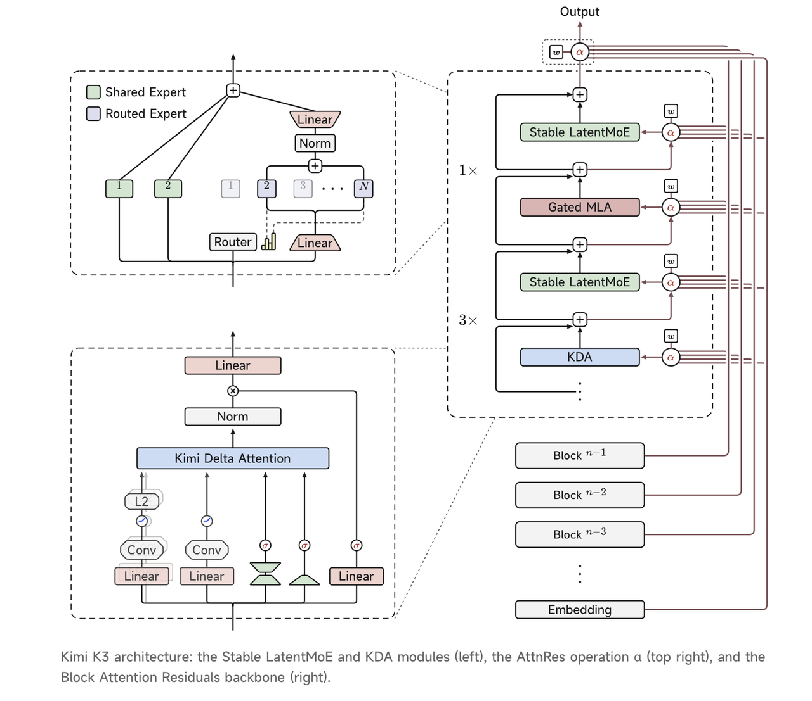
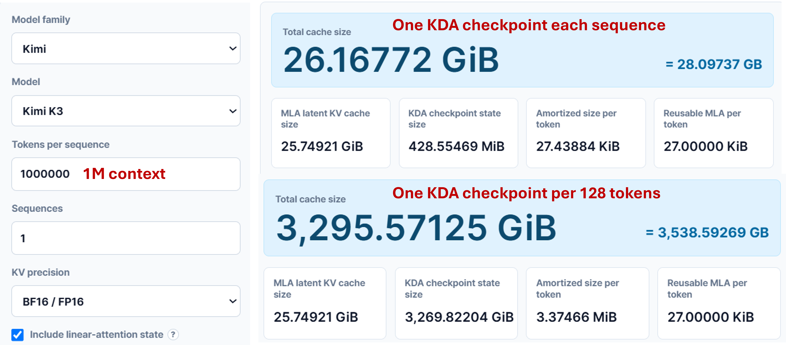
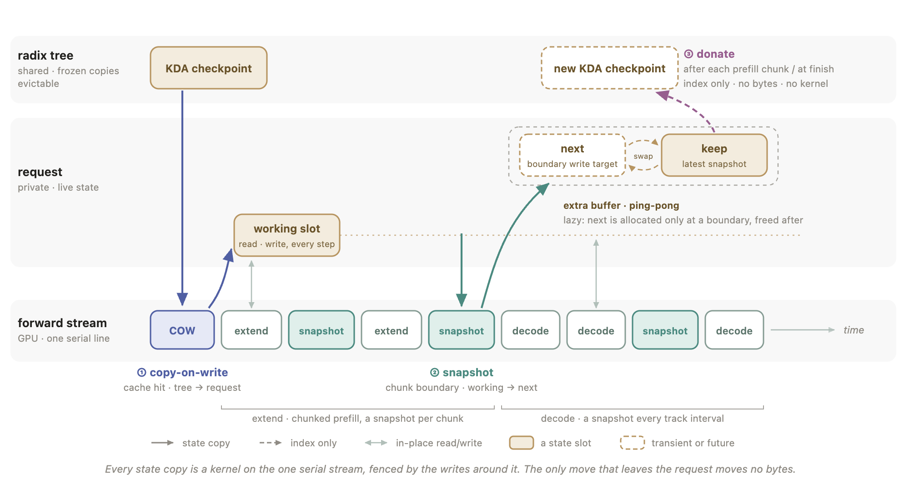
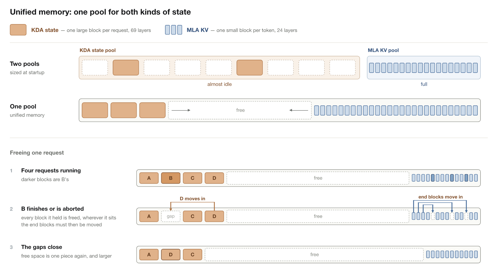
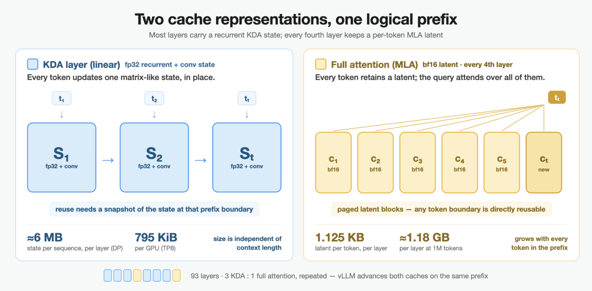
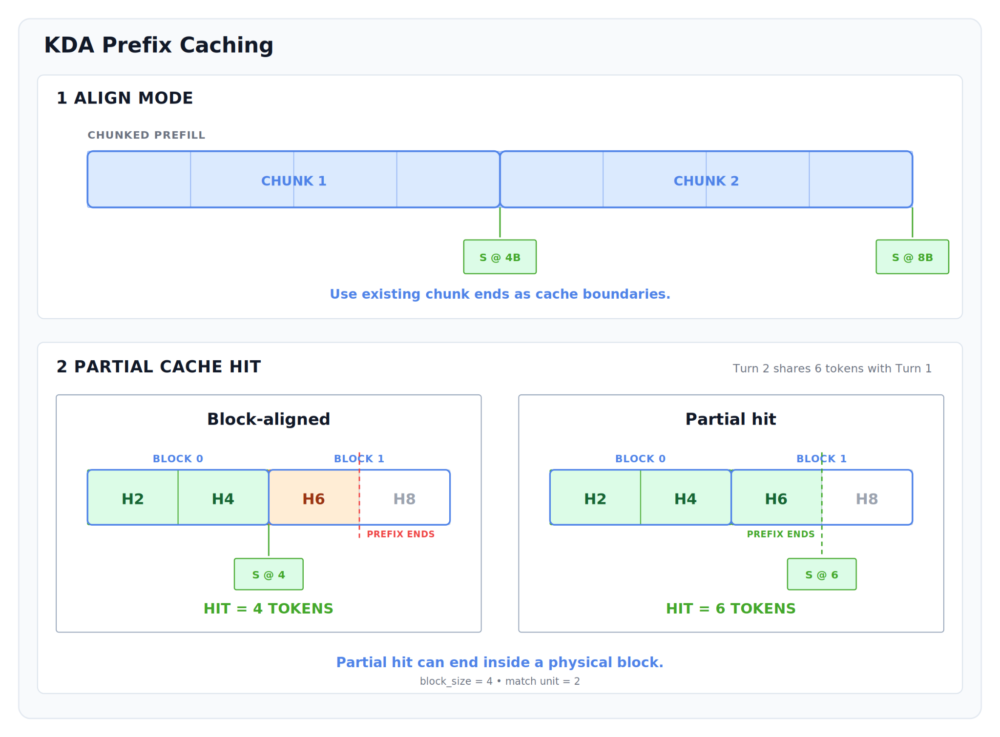
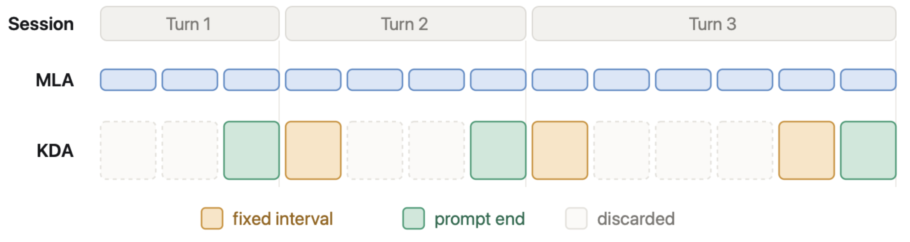
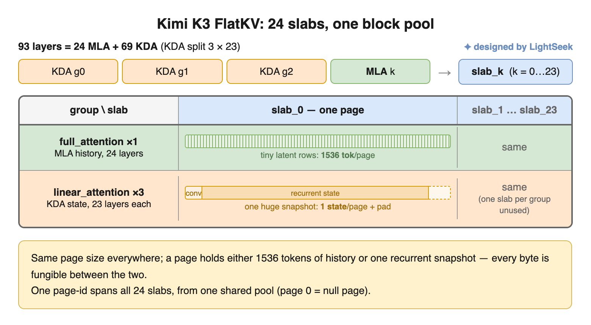
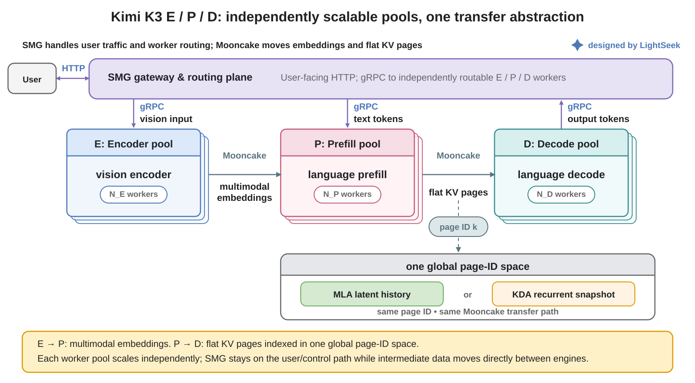

On July 27, Moonshot AI officially open-sourced its next-generation flagship model, **Kimi K3**. With a total parameter count of **2.8 trillion**, K3 adopts a highly sparse Mixture-of-Experts (MoE) architecture, where only 16 out of 896 experts are activated for each token. It is currently one of the largest open-weight models in the world by parameter scale.

Beyond its massive parameter size, K3 also introduces comprehensive upgrades to its model architecture. It features a new linear attention mechanism, **Kimi Delta Attention (KDA)**, which works together with MLA (Multi-head Latent Attention) to form a hybrid attention architecture. This design enables native support for a **1 million-token context window** while balancing long-context reasoning efficiency and model performance. Meanwhile, K3 natively supports vision understanding and achieves leading performance among open models across multiple benchmarks, including coding, agent tasks, and complex reasoning.

Mooncake has been part of the journey across multiple Kimi generations, providing stable and efficient infrastructure for large-scale inference through its disaggregated inference architecture. As a key partner in the K3 inference ecosystem, Mooncake, together with SGLang, vLLM, and TokenSpeed, completed Day-0 integration support on the day K3 was open-sourced, covering critical areas such as cross-instance KV Cache reuse, PD disaggregation, and EPD disaggregation. Users can deploy K3 on top of Mooncake and gain large-scale distributed inference capabilities out of the box. In scenarios such as multi-turn conversations and agentic workloads, Mooncake significantly reduces redundant computation overhead and helps fully unlock K3’s long-context capabilities.

However, the impact of K3 goes far beyond simply making the model “larger.” Compared with traditional Transformers, the KDA-based hybrid attention mechanism introduced in K3 fundamentally changes the nature of caching. The system must manage not only traditional KV Cache, but also new model states such as Recurrent States. As a result, conventional designs for Prefix Cache reuse and disaggregated inference architectures must evolve accordingly.

In this article, we will introduce how SGLang, vLLM, and TokenSpeed adapt to Kimi K3’s new caching semantics, and how Mooncake works together with these frameworks to provide complete distributed inference capabilities for K3.

## KDA: A New Attention Architecture for Kimi K3

For inference systems, the changes brought by Kimi K3 go far beyond simply increasing the model’s parameter scale. More importantly, K3 introduces a fundamentally new hybrid attention architecture that **combines KDA (Kimi Delta Attention) with MLA (Multi-head Latent Attention)**.

In the open-sourced K3 configuration, the model contains a total of 93 decoder layers, among which **69 layers adopt KDA and 24 layers adopt MLA**. These layers are generally organized in a pattern of three consecutive KDA layers followed by one MLA layer. Therefore, unlike traditional models where all layers rely on a unified attention mechanism, K3 simultaneously employs two fundamentally different approaches for representing and maintaining historical information inside the model.



MLA follows the latent attention design: each token produces its own latent KV, so the cache still grows with context length, as in a traditional Transformer KV Cache.

The fundamental change comes from **KDA**. Instead of storing every historical Key and Value, it recurrently compresses history into a fixed-size state. Per-channel decay factors and Delta Correction control how new information updates this state, while a fixed-length Convolution Window preserves recent local context.

Therefore, for each KDA layer, the historical information that needs to be continuously maintained is no longer a long sequence of KV pairs, but two types of states:

- **Recurrent state:** the recurrently updated historical state;
- **Convolution window:** the local window containing the most recent tokens.

As new tokens arrive, both states are updated in place rather than continuously growing like traditional KV Cache. The key advantage of this design is that the amount of cache required during inference no longer scales linearly with the context length. Even with million-token contexts, the recurrent states maintained by KDA layers remain at a fixed size, significantly reducing the memory pressure of long-context inference.

## What New Challenges Does KDA Introduce for Inference Systems?

### When Prefix Cache Meets KDA

KDA substantially reduces cache overhead during long-context inference, but it also fundamentally changes the semantics of caching.

In a traditional Transformer, each token has its own independent Key and Value. An inference framework can use structures such as a Radix Tree to identify the longest common prefix across requests, reuse the corresponding KV Cache, and skip redundant Prefill computation. In this setting, Prefix Cache reuse is almost equivalent to KV Cache reuse: once a token prefix matches, the cache associated with that prefix can be restored directly.

KDA breaks this equivalence. In Kimi K3, MLA layers still maintain token-level latent KV, while KDA layers maintain a Recurrent State produced by processing the entire prefix sequentially. As a result, two fundamentally different forms of cache coexist within the same model.

More importantly, a KDA state cannot be truncated arbitrarily in the way a KV Cache can. Suppose a request has processed 10,000 tokens and the system stores a KDA state only at the 10,000-token position. If another request shares only the first 8,000 tokens, it cannot resume from that state at the 8,000-token boundary. The stored state has already incorporated information from the subsequent 2,000 tokens, and there is no way to reverse the recurrence and reconstruct the earlier state.

Therefore, **a token-level prefix match does not necessarily imply that the corresponding KDA cache can be restored**. To guarantee that restored execution is equivalent to uninterrupted execution, the MLA KV and the complete KDA state must both be available and aligned to the same prefix boundary. This means that a KDA-aware Prefix Cache must explicitly store checkpoints at selected prefix boundaries. Even when the MLA KV matches a longer prefix, the system must fall back to the nearest valid boundary if the corresponding KDA checkpoint is unavailable, and recompute everything after that point.

For Kimi K3, Prefix Cache reuse is therefore no longer a matter of storing and restoring a segment of KV Cache. The system must jointly manage MLA KV and KDA Recurrent States, while ensuring that both can be restored consistently at the same prefix boundary.

DeepSeek V4’s SWA (Sliding Window Attention) presents a similar issue, but its solution is relatively straightforward: the system can store a checkpoint at a fixed interval, such as every 128 tokens. For KDA, however, this strategy is prohibitively expensive because each checkpoint is much larger. According to the [KV Cache Size Calculator](https://kvcache.ai/tools/kv-cache-calculator/), a single KDA checkpoint introduces approximately 0.4 GiB of fixed cache overhead. With a checkpoint interval of 128 tokens, a request with a 1-million-token context would require roughly 3 TB of storage for KDA states alone. Even with a much coarser interval of 10,000 tokens, the same request would still require approximately 40 GB of additional cache.

Increasing the checkpoint interval, however, introduces another problem. Prefix Cache reuse can only extend to the nearest recoverable KDA checkpoint. The sparser the checkpoints are, the shorter the prefix that can actually be reused.

Assume that checkpoints are stored every 10,000 tokens:

1. If two 20,000-token requests share the first 15,000 tokens, the system can only reuse the prefix up to the 10,000-token checkpoint. Instead of computing only the remaining 5,000 tokens, it must recompute 10,000 tokens, effectively doubling the amount of computation.

2. If two 910,000-token requests share the first 905,000 tokens, the cache reuse ratio still appears very high. However, because the nearest checkpoint is located at 900,000 tokens, the system must again recompute 10,000 tokens rather than the original 5,000 tokens, resulting in the same twofold increase in computation.

These are not rare edge cases. In fact, they closely match the typical characteristics of agentic workloads: many interaction rounds, only a small number of new tokens added in each round, and often more than 95% of the context shared between consecutive turns. In such scenarios, even a decline of only a few percentage points in the effective Prefix Cache hit rate can lead to a substantial increase in the number of tokens that must be recomputed.

KDA cache management therefore presents a fundamental trade-off. Denser checkpoints provide finer-grained recovery and improve the effective Prefix Cache hit rate, but they also cause cache consumption to grow rapidly. Sparser checkpoints reduce storage overhead, but require the system to recompute a longer suffix after every cache hit, weakening the performance benefits of caching.

This is the core challenge that must be addressed to support efficient Prefix Cache reuse for Kimi K3.

### When Disaggregated Inference Meets KDA

The changes introduced by KDA affect not only Prefix Cache reuse within a single instance, but also cache management in disaggregated inference architectures. In traditional Transformers, both cross-instance cache reuse and Prefill–Decode disaggregation are built around the unified abstraction of KV Blocks. As long as the token prefixes match, the corresponding KV Cache can be reused or transferred directly. For Kimi K3, however, the cache now consists of two different types of state: MLA KV and KDA State. MLA KV can still be managed at token or block granularity, while a KDA State can only be restored from a checkpoint associated with a specific prefix boundary. As a result, cross-instance reuse is no longer simply a matter of finding the longest matching token prefix. The system must ensure that both MLA KV and KDA State are available and consistent at the same recovery point, rather than freely combining cache data from different sources.

The same issue also affects Prefill–Decode disaggregation. What must be transferred between the Prefill and Decode stages is no longer just a collection of KV Blocks, but a set of heterogeneous model states, including MLA latent history and KDA Recurrent States. Designing a separate transfer protocol for each state type would not only increase system complexity, but also expose model-specific architectural details to the scheduling and communication layers. Therefore, Prefill–Decode disaggregation must evolve from **KV Cache transfer** into a more general abstraction of **model state transfer**.

In multimodal workloads, the disaggregated pipeline expands further into Encoder–Prefill–Decode (EPD). The system must transfer not only the MLA and KDA states produced during Prefill, but also the visual embeddings generated by the Encoder. Building a unified data plane that can efficiently move different types of model state across different execution stages therefore becomes a new challenge for disaggregated Kimi K3 inference.

## SGLang × Mooncake: A KDA-Aware Radix Tree and Cross-Instance Cache Reuse

To accommodate the changes KDA introduces to Prefix Cache semantics, SGLang extends its existing Radix Tree with a KDA-aware checkpointing mechanism. The Radix Tree still matches token prefixes across requests, but a recoverable position is no longer determined solely by the longest matching token prefix. Instead, both MLA KV and KDA State must be available and consistent at the same prefix boundary.

SGLang therefore maintains sparse KDA checkpoints within the Radix Tree. When a request matches an existing token prefix, the system searches the matched path for the nearest valid checkpoint, restores the corresponding MLA KV and KDA State together, and recomputes the portion not covered by that checkpoint.



### Sparse Checkpoint Management: Balancing Cache Cost and Recomputation

To address the trade-off between checkpoint storage overhead and cache hit rate described above, SGLang adopts a sparse checkpoint management strategy that maximizes the benefits of Prefix Cache reuse under a limited cache budget.

First, for **checkpoint selection**, SGLang does not rely on a simple fixed-interval policy. Instead, it selects higher-value checkpoint locations based on the request execution stage:

* **Prefill stage:** Prefill is typically executed in chunks, so SGLang prioritizes storing checkpoints at chunk boundaries. This aligns checkpoint creation with the existing scheduling flow and avoids introducing additional synchronization overhead solely to preserve intermediate states.
* **Decode stage:** Because every generated token may become part of a shared prefix for future requests, SGLang creates checkpoints at fixed intervals during Decode, balancing recovery granularity against cache overhead.
* **Radix Tree branch points:** When multiple requests share a prefix or diverge at a particular position, that position is more likely to become a cache hit point for future requests. SGLang therefore prioritizes retaining checkpoints at these high-reuse-value locations.

With this strategy, checkpoints are no longer distributed uniformly across all token positions. Instead, they are concentrated at prefix boundaries that are more likely to be reused.

Second, for **checkpoint budget management**, SGLang must limit the amount of GPU memory consumed by KDA States. Storing too many checkpoints along each Radix Tree path would quickly exhaust cache capacity, even if each individual cache hit provides substantial benefit. SGLang therefore limits the number of checkpoints retained on each path and combines this constraint with an LRU (Least Recently Used) policy to evict lower-value states:

* Checkpoints that have not been accessed for a long time are reclaimed first.
* Checkpoints on frequently accessed paths are retained.
* Newly generated checkpoints replace existing states only when justified by the current cache pressure.

In effect, SGLang turns checkpoint management into an access-pattern-aware cache optimization problem. More state budget is allocated to positions with higher value and a greater probability of reuse, while infrequently used states are released promptly.

This sparse checkpointing mechanism avoids the excessive GPU memory overhead of fixed-interval checkpointing, while also reducing the amount of replay caused by checkpoints that are too sparse. As a result, KDA-aware Prefix Cache reuse can scale effectively to long-context and agentic workloads.

### Compressed Checkpoint Storage: Reducing the Residency Cost of Inactive KDA States

Building on sparse checkpoint management, SGLang further reduces the storage overhead of KDA States. Not every cached checkpoint is needed for immediate computation, and retaining all states in a high-precision format for extended periods would consume a large amount of GPU memory. SGLang therefore separates the active states used by currently running requests from the cached states stored in the Radix Tree. Active states remain in a runtime state pool, while inactive checkpoints are moved to a separate cache pool and stored in a compressed format.

SGLang currently also provides an optional local checkpoint compression path. It compresses inactive Recurrent States to INT8, trading some restoration accuracy for greater local cache capacity. For the KDA temporal state, which accounts for most of the storage footprint, SGLang computes quantization parameters on a per-channel basis and compresses the state to INT8. The much smaller local window state remains in its original precision. Compared with storing the complete KDA State in BF16, this approach substantially reduces the storage cost of each checkpoint, allowing more reusable prefix states to be retained under the same cache budget.

When a request hits a compressed checkpoint, SGLang does not continue execution directly from the compressed representation. Instead, it first restores the checkpoint into a new active-state slot, reconstructs the corresponding local window state, and then resumes computation at normal precision. Because compression occurs only when a checkpoint is stored, and decompression only when that checkpoint is hit, the per-token KDA state update always runs at the original precision. This avoids the accumulation of errors that could otherwise result from repeated quantization and dequantization.

### Mutable State Sharing: Safely Reusing Mutable KDA States in Prefix Cache

KDA States are continuously updated during Decode, while shared states in the Prefix Cache must remain immutable. Unlike MLA KV Cache, which does not change once written, a KDA State cannot be directly shared across multiple requests, because updates from one request could affect the execution of others. To safely reuse KDA States, SGLang separates per-request execution states from shared checkpoints through three mechanisms: Copy-on-Write, Snapshot, and Donate.

**Copy-on-Write: Safely restoring from a shared checkpoint.** When a request hits a KDA checkpoint in the Radix Tree, SGLang does not continue execution directly on the shared state. Instead, it first copies the KDA State associated with the checkpoint into a private execution slot owned by the request. Subsequent computation updates only this private state, leaving the shared checkpoint attached to the Radix Tree unchanged. This allows multiple requests to safely reuse the same Prefix Cache node while advancing their own states independently.

**Snapshot: Converting runtime state into reusable state.** By default, a KDA State produced during request execution belongs exclusively to the current request. When the request reaches a new cacheable prefix boundary, SGLang saves the current runtime state as a new Snapshot and attaches it to the Radix Tree for future requests to restore. To prevent the Snapshot operation from racing with state updates during Forward, SGLang schedules the state copy on the Forward Stream and relies on CUDA Stream ordering to guarantee safe reads and writes. Snapshots are also written alternately into additional buffers, preventing a new Snapshot from overwriting an older state that is still referenced by the Radix Tree.

**Donate: Reducing checkpoint creation overhead.** Copying the entire KDA State into the cache tree every time a Snapshot is created would introduce substantial data-movement overhead. SGLang therefore introduces a Donate mechanism. Once a Snapshot is complete, the system transfers ownership of the corresponding state slot directly to the Radix Tree and updates only the state index, without copying the underlying data again. With Donate, checkpoint creation becomes a lightweight metadata transfer rather than a large-scale state copy, significantly reducing the management overhead of integrating KDA States into Prefix Cache reuse.

### Unified Memory: Sharing Physical Cache Capacity Between MLA KV and KDA State

Because MLA KV and KDA State differ in allocation granularity and lifecycle, SGLang initially manages them through two separate memory pools. MLA KV Blocks and KDA State Blocks are allocated from independently reserved GPU memory pools. This design keeps the two cache types logically isolated, but requires the system to estimate their capacity ratio in advance based on the expected workload.

In real-world inference workloads, however, cache demand is often difficult to predict. When short requests dominate, the KDA State Pool may be exhausted first. In long-context workloads, the MLA KV Pool may instead become the bottleneck, even while unused GPU memory remains available in the other pool. This imbalance reduces overall GPU memory utilization.

To address this issue, SGLang provides an optional **Unified Memory** mode that manages MLA KV Blocks and KDA State Blocks within a shared physical capacity pool. The two cache types retain their own logical structures and allocation granularities, but draw from the same underlying GPU memory capacity, allowing memory usage to shift dynamically according to the actual workload.



In the implementation, Unified Memory reserves a contiguous GPU memory region. KDA State Blocks and MLA KV Blocks grow inward from opposite ends, while the space between them serves as a shared pool of free capacity. When an object is released, the system fills the resulting hole with an object from the corresponding end, keeping the available region contiguous and reducing memory fragmentation during long-running workloads.

It is important to note that “unified” refers to unified management of physical capacity. It does not mean forcing MLA KV and KDA State into pages of the same size. Each cache type is still allocated and managed using the layout best suited to its own characteristics; they simply share unused capacity at the GPU memory level.

This mode can be enabled explicitly with `--enable-unified-memory`, allowing SGLang to adapt more flexibly to the cache demands of Kimi K3’s hybrid attention architecture across different request distributions.

### Mooncake Integration: Extending KDA Cache Reuse Across Instances

The optimizations described above address KDA-aware Prefix Cache management within a single SGLang instance. In large-scale inference deployments, however, the capacity of a single instance’s GPU cache remains limited, and many long-context prefixes with high reuse value cannot be retained indefinitely.

To further expand the scope of cache reuse, SGLang integrates Mooncake into its KDA-aware caching system. Through HiCache, cached objects can extend beyond the GPU memory of a single machine into a much larger shared cache tier. When a new request arrives, the system can query not only the local Radix Tree Cache, but also retrieve cache states produced by other inference instances from Mooncake, restore them on the current instance, and resume execution.

Mooncake does not participate in the generation, update, or restoration semantics of KDA States. It therefore does not need to understand the differences between the model’s internal attention mechanisms. Its responsibility is to efficiently manage and transfer cache objects that SGLang has already determined to be valid and reusable. This separation of responsibilities allows SGLang and Mooncake to independently handle correctness and distributed scalability: SGLang determines **which states can be reused**, while Mooncake determines **how those states move across instances**.

With HiCache and Mooncake’s cross-instance caching capabilities, Kimi K3’s MLA KV and KDA States can move beyond the memory limits of a single GPU instance and be shared across a larger inference cluster. This improves cache hit rates and reduces redundant computation for long-context inference, multi-turn conversations, and agentic workloads.

## vLLM × Mooncake: Hybrid Cache Management and Cross-Instance Reuse for Kimi K3

Unlike SGLang’s Radix Tree–based approach to state management, vLLM starts from a unified cache management framework. It incorporates both MLA KV and KDA State into the Hybrid KV Cache Manager, then combines flexible cache retention policies with Mooncake’s distributed caching capabilities to enable cross-instance reuse.

### Hybrid KV Cache Manager: Unified Management of MLA KV and KDA State

As discussed earlier, MLA KV Cache and KDA State in Kimi K3 differ significantly in lifecycle, update semantics, and reuse granularity. Traditional KV Cache management mechanisms therefore cannot be applied directly.

To address this, vLLM extends its existing KV Cache management framework through the Hybrid KV Cache Manager, allowing a single Scheduler to coordinate two types of cache objects with different lifecycles. Full-attention layers continue to use Paged KV Blocks for token-level KV Cache, while KDA layers additionally maintain recurrent states and convolution states. Both types of state share the same request scheduling pipeline, but follow different cache management models: MLA KV is appended at token or block granularity and remains immutable once written, whereas KDA State records recoverable execution points through cacheable recurrent-state checkpoints or state blocks, while each running request maintains its own independent active copy.



To prevent KDA State management from constraining the matching granularity of Prefix Cache reuse, vLLM decouples logical prefix matching from the physical locations where states are stored. Request matching is based on fine-grained, chained prefix hashes, which can identify a match within a physical state block rather than treating the physical KV block as the minimum matching unit. This allows the system to locate shared prefixes at a finer granularity.

KDA State Blocks, meanwhile, do not need to cover every token position. They are stored only at selected prefix boundaries. When a request resumes execution from a shared prefix, vLLM first copies the corresponding KDA State into request-private storage before continuing computation. This prevents in-place updates from corrupting cached states that are shared by other requests.

### Fine-Grained Partial Hits: Decoupling Prefix Cache Reuse from KDA Block Boundaries

In vLLM, KDA State does not allocate an independent cache entry for every token as MLA KV does. Instead, it uses larger State Blocks as the basic unit of management. Each State Block stores the recurrent state and convolution state produced after processing a contiguous range of tokens. This design reduces state allocation and management overhead, but introduces a new problem: the actual shared-prefix length between requests rarely aligns exactly with State Block boundaries.

If Prefix Cache matching were restricted to KDA State Block boundaries, a valid KDA state checkpoint at a finer-grained prefix position could not be reused directly. For example, suppose a KDA State Block covers 4,096 tokens, while two requests share a prefix of 4,480 tokens. A conventional block-aligned cache could recognize only the first 4,096 tokens, forcing the subsequent request to reuse a shorter prefix than is actually available.



To address this issue, vLLM introduces **Fine-Grained Partial Hits**, decoupling the granularity of Prefix Matching from the physical storage granularity of KDA State. The system continues to use large KDA State Blocks for managing the underlying state, while allowing finer-grained Prefix Entries to be recorded within each State Block.

Once a valid KDA State Block has been generated for a particular token boundary, that position can serve as a legal recovery point even if it falls inside a State Block that has not yet been fully populated. In the example above, vLLM can directly record a Prefix Entry at the 4,480-token position, allowing subsequent requests to recover from the longer shared prefix without creating an additional full copy of the KDA State.

### Adaptive Checkpoint Retention: Preserving KDA States Based on Reuse Value

The introduction of KDA State makes checkpoints a critical resource for Prefix Cache reuse. However, because each KDA State has a substantial memory footprint, storing one at every prefix position is impractical. To determine how a limited cache budget should be allocated to the positions most likely to be reused, vLLM provides two complementary KDA State retention policies: **Interval-Based Retention** and **Marconi-Style Selective Retention**. The former uses known structural boundaries to provide stable recovery points, while the latter dynamically identifies prefixes with genuine reuse value based on runtime access patterns.

**Strategy 1: Interval-Based Retention — Storing Checkpoints at Structured Boundaries.**



In workloads with clear contextual structure, such as multi-turn conversations and agentic tasks, certain prefix boundaries naturally have a higher probability of reuse. vLLM therefore supports storing KDA checkpoints at fixed intervals, while also retaining the state at the end of each Prompt.

For example, the system can create a checkpoint every fixed number of tokens and automatically preserve the KDA State at each Prompt boundary. Compared with mechanically distributing checkpoints at uniform intervals, Prompt-end States are often more valuable for real-world workloads. In multi-turn conversations, the next request typically reuses the entire Prompt from the previous turn, so restoring from the end of that Prompt can eliminate a large amount of redundant computation.

Users can configure the interval through `VLLM_PREFIX_CACHE_RETENTION_INTERVAL`. When this value is set to `0`, vLLM disables periodic checkpointing and retains only Prompt-end States, reducing cache overhead for workloads dominated by multi-turn conversations.

**Strategy 2: Marconi-Style Selective Retention — Caching Only Truly Hot Prefixes.**



A fixed-interval policy can capture predictable reuse patterns, but it cannot determine in advance whether dynamically occurring shared prefixes—such as system prompts, code repository snapshots, or tool definitions—will be reused. Saving a KDA State immediately when such a prefix first appears may allow a one-off prefix to consume a large amount of cache capacity.

vLLM therefore introduces **Marconi-Style Selective Retention**, built around a simple principle: **cache on the second hit**.

When a prefix appears for the first time, the system records its access metadata but does not immediately store the corresponding KDA State. Only when a later request hits the same prefix again—demonstrating that it has actual reuse value—does vLLM create a KDA checkpoint at that position. This prevents one-off long Prompts from wasting cache budget, while automatically promoting frequently accessed hot prefixes into reusable states.

Together, these two policies cover both **predictable reuse boundaries** and **hot-prefix patterns discovered at runtime**.

### Mooncake Integration: Extending Hybrid Cache Reuse Across Instances

The optimizations described above address unified MLA KV and KDA State management, fine-grained prefix matching, and state restoration within a single vLLM instance. For large-scale distributed inference, vLLM further integrates Mooncake through the KV Connector, extending the Hybrid Cache from per-instance storage to cross-instance sharing.

For hybrid-attention models such as Kimi K3, Mooncake no longer stores a single KV Block. Instead, it stores a collection of Hybrid Cache objects associated with the same prefix. MLA KV continues to be represented as Paged KV Blocks, while KDA State is stored as a Snapshot at the corresponding prefix position. To prevent collisions across different cache types, vLLM distinguishes objects written to Mooncake using information such as the Cache Group, Prefix Hash, and parallelism configuration. This ensures that MLA KV, KDA State, and data from different ranks remain correctly aligned.

To extend the Fine-Grained Partial Hit mechanism to remote caching, vLLM stores the KDA State associated with each Fine-Grained Prefix Entry in Mooncake as well. During writes, the system preserves not only complete blocks, but also Partial States that have been validated through Scheduler Alignment, allowing remote instances to hit the same fine-grained prefix boundaries. MLA KV and KDA State are managed using consistent prefix identifiers, ensuring that both cache types always correspond to the same logical prefix during remote restoration.

When a request arrives at a new inference instance, vLLM queries both the local cache and Mooncake’s remote cache. It determines the available ranges of MLA KV and KDA State from each source, then coordinates the local and remote results to select the final Hybrid Cache Boundary. If Mooncake provides a longer and complete pair of MLA and KDA states, the system loads the remote cache and supersedes the shorter local hit. If the remote cache cannot provide a longer consistent state, vLLM continues using the local cache and avoids unnecessary data transfer.

By integrating Mooncake through the KV Connector, vLLM extends the lifecycle of the Hybrid Cache beyond the GPU memory of a single instance and into a distributed cache tier. vLLM is responsible for maintaining semantic consistency between MLA KV and KDA State, while Mooncake provides efficient cross-instance storage and data movement. Together, they allow Kimi K3’s long-context state to be reused not only within a single machine, but also across large-scale inference clusters, significantly reducing redundant computation in multi-turn conversations, coding agents, and other high-reuse workloads.

## TokenSpeed × Mooncake: A Unified Data Plane from Flat KV to Multimodal EPD

Traditional Prefill–Decode (PD) disaggregation primarily addresses the transfer of KV Cache between inference nodes. After a Prefill node finishes processing the input context, it sends the resulting KV Blocks to a Decode node, which then continues generation. For next-generation models such as Kimi K3, however, the data being transferred is no longer a homogeneous collection of KV Cache blocks.

Kimi K3 adopts a hybrid attention architecture that combines MLA and KDA, whose state lifecycles, update granularities, and physical layouts all differ from those of conventional KV Cache. Continuing to manage and transfer each state type using traditional KV Cache abstractions would not only increase system complexity, but also allow model-specific architectural details to leak into the scheduling, caching, and network transport layers.

The challenge for next-generation disaggregated inference systems is therefore no longer simply **how to transfer KV Cache**, but **how to efficiently transfer heterogeneous model intermediate states**. TokenSpeed addresses this through Flat KV, which represents MLA KV and KDA State as unified, transferable data units. Combined with Mooncake’s high-performance transport capabilities, this data plane extends beyond traditional PD disaggregation to support multimodal Encoder–Prefill–Decode (EPD) disaggregation.

As a result, Mooncake is no longer merely a KV transport channel between Prefill and Decode. It becomes a unified state-transfer infrastructure spanning the model’s different execution stages.

### Flat KV: A Unified Page-Level State Representation

To address the heterogeneous physical management requirements of MLA KV and KDA State, TokenSpeed introduces **Flat KV**, which brings both state types under a unified page-granularity management model. The core idea is that different model states do not need to share the same internal data layout, but they should be mappable to a common cache management unit.

In Flat KV, a single page can store either the MLA latent history for 1,536 tokens or one complete KDA recurrent snapshot. In other words, both the token-growing MLA KV and the fixed-size KDA State are abstracted as page objects of the same size and managed through a unified page allocator.



TokenSpeed divides Kimi K3’s 69 KDA layers into three groups of 23 layers each. These groups, together with the full-attention group, are mapped onto 24 physical slabs. Different state types share the same page address space: a given global page ID always maps to a fixed physical location, allowing MLA KV and KDA snapshots to use the same allocation, reclamation, and ownership management mechanisms.

The key value of this design is that it transforms KDA State from a special-purpose model state into a page object that can be managed by existing KV Cache infrastructure:

* Prefix Cache can manage MLA KV pages and KDA State pages through a unified interface.
* State operations such as Copy-on-Write can reuse the same page lifecycle management.
* In PD disaggregation, the system only needs to transfer pages, without designing separate transport protocols for different state types.

Flat KV therefore does more than place two data types in the same memory pool. It redefines the cache abstraction for disaggregated inference: KV Cache is no longer limited to token-level Key and Value tensors, but becomes a unified page-based representation capable of carrying heterogeneous model intermediate states.

### Mooncake PD Integration: Efficiently Transferring Flat KV Pages

Building on Flat KV’s page-based representation, TokenSpeed extends the transfer unit in PD disaggregation from conventional KV Blocks to unified pages. Both MLA KV and KDA State can be represented as the same data-movement unit and managed through a shared page ID space and metadata format.

Mooncake then handles cross-node data transfer at the page level. The Prefill node only needs to provide the page IDs to be transferred, together with their associated metadata. The Mooncake Transfer Engine can directly locate and transfer the corresponding physical regions in GPU buffers, without needing to understand whether a page contains MLA KV or KDA State.

In the implementation, the Prefill node first determines which pages must be transferred from the Flat KV page table, then generates the corresponding page metadata, including the global page ID and physical address mapping. Based on this metadata, the Mooncake Transfer Engine directly transfers the physical pages between registered GPU buffers, without CPU staging or additional data-format conversion.

After receiving the pages, the Decode node reconstructs the corresponding cache view using the same global page ID space. Because MLA KV pages and KDA State pages share a unified page management model, the Decode side does not need separate receiving and restoration paths for different state types. The Flat KV mapping layer interprets each physical page as the appropriate logical cache object.

Flat KV and Mooncake therefore establish a clear separation of responsibilities: TokenSpeed converts heterogeneous model states into a unified page representation, while Mooncake efficiently transfers those pages between Prefill and Decode nodes. Changes to the model architecture affect only the Flat KV mapping logic, leaving the underlying transport path unchanged.

### EPD Disaggregation: A Unified Data Plane from Prefill–Decode to Encoder–Prefill–Decode

Because Kimi K3 natively supports visual inputs, its inference pipeline is no longer limited to the Prefill and Decode stages. Instead, it must be extended into a three-stage Encoder–Prefill–Decode (EPD) architecture. To support this design, TokenSpeed separates the Encoder from the computations previously embedded within Prefill, turns it into an independent serving stage, and uses Mooncake to build a data-transfer path spanning all three stages.

In TokenSpeed’s EPD architecture, Encoder, Prefill, and Decode each have their own worker pool, scheduling policy, and scaling capabilities. The SMG (Serving Management Gateway) is responsible for request orchestration, inter-stage routing, and request-state association, allowing all three stages to be deployed and scaled independently according to their workload characteristics.

The Encoder focuses on visual input processing and can scale independently based on factors such as image count and resolution. Prefill combines visual embeddings with the textual context and performs context computation, while Decode handles subsequent token generation. By decoupling these stages, vision-intensive requests involving multiple images or high-resolution inputs no longer directly compete with the language model’s Prefill and Decode stages for compute resources.

At the data-transfer layer, Mooncake evolves from a KV Cache channel for traditional PD disaggregation into a unified data plane spanning the entire EPD pipeline. The end-to-end path includes two types of large-scale data transfer:

* **Encoder → Prefill: Visual embedding transfer.** After completing visual encoding, the Encoder uses Mooncake to transfer the resulting visual embeddings directly from the Encoder node’s GPU to the Prefill node’s GPU. This process requires neither CPU-side serialization nor an intermediate shared file system, substantially reducing data-movement overhead for large-scale visual inputs.
* **Prefill → Decode: Flat KV page transfer.** After completing language-context computation, the Prefill stage sends the MLA latent history and KDA recurrent state represented in Flat KV to the Decode node through Mooncake. Because Flat KV has already abstracted different model states into unified pages, Mooncake can reuse the same page-based transport mechanism used in PD disaggregation.

TokenSpeed reuses the same memory registration, endpoint discovery, and transfer-completion tracking mechanisms across both the E→P and P→D paths, rather than maintaining separate data channels for visual embeddings and KV states. Mooncake therefore does not need to understand the specific semantics of the objects transferred between stages; it only needs to move data objects in GPU memory efficiently.

## Conclusion

As next-generation model architectures such as KDA, Mamba, GDN, and SWA continue to emerge, the scope of what inference systems need to manage is expanding beyond traditional KV Cache. It is gradually evolving into the management of a combination of multiple model intermediate states, including KV states, recurrent states, convolution states, and more.

Mooncake is evolving from a cache backend designed primarily for Transformer KV Cache into a distributed storage and data transfer infrastructure built to support diverse model architectures. Meanwhile, the integration of SGLang, vLLM, TokenSpeed, and Mooncake enables Kimi K3 to gain comprehensive and efficient long-context caching capabilities from day-0, delivering lower-latency and higher-throughput inference experiences for key scenarios such as code assistants, agents, and RAG applications.

This series of efforts would not have been possible without the collective contributions of the open-source community. We would like to thank the teams behind SGLang, vLLM, TokenSpeed, and Mooncake for their continued effort in adapting to emerging model architectures and optimizing inference performance. We also appreciate everyone who shared valuable feedback and hands-on experience throughout testing and deployment.

Together, we will continue exploring the next generation of caching and data transfer systems designed for a broader range of model architectures and increasingly large-scale inference systems.

## Related Links

Kimi K3 blog: https://www.kimi.com/blog/kimi-k3

SGLang blog: https://www.lmsys.org/blog/2026-07-27-kimi-k3-day0-support

vLLM blog: https://vllm.ai/blog/2026-07-27-k3

TokenSpeed blog: https://lightseek.org/blog/tokenspeed-kimi-k3.html

Mooncake: https://github.com/kvcache-ai/Mooncake
