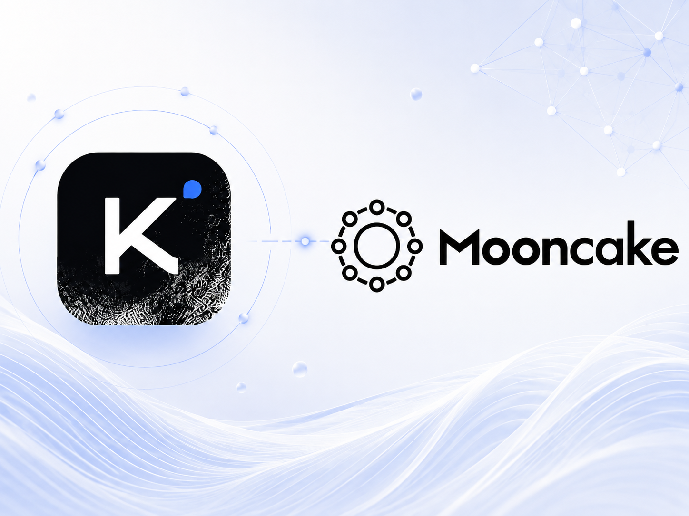

On July 27, Moonshot AI released the open weights for Kimi K3, a 2.8-trillion-parameter Mixture-of-Experts (MoE) model that activates 16 of 896 experts per token. K3 is the first open model in the 3-trillion-parameter class.

Beyond scale, K3 introduces several architectural changes. Its attention stack combines **Kimi Delta Attention (KDA)**, a recurrent linear-attention mechanism, with **Gated Multi-head Latent Attention (Gated MLA)**, referred to below as MLA. This hybrid design supports a **1-million-token context window** while reducing the memory cost of long-context inference. K3 also provides native vision capabilities and reports strong results across coding, agentic, reasoning, and multimodal benchmarks.

**Mooncake** has supported multiple generations of Kimi through its disaggregated inference infrastructure. For K3, Mooncake worked with **SGLang**, **vLLM**, and **TokenSpeed** on Day-0 integration covering cross-instance key-value (KV) cache reuse, prefill–decode (PD) disaggregation, and encoder–prefill–decode (EPD) disaggregation. In multi-turn conversations and agentic workloads, these mechanisms reduce repeated prefill computation and extend cache reuse beyond a single worker.

The systems implications of K3 are not primarily about model scale. Its KDA–MLA hybrid attention changes the cache abstraction itself: the runtime must manage token-level MLA KV together with mutable KDA recurrent and convolution state. Prefix caching and disaggregated serving therefore require recovery and transfer semantics that go beyond a conventional KV cache.

This article examines how SGLang, vLLM, and TokenSpeed adapt their cache-management paths to Kimi K3, and how Mooncake extends those mechanisms across workers through distributed storage and data movement.

## KDA: A New Cache Abstraction for Kimi K3

For inference systems, the most consequential change in Kimi K3 is its hybrid KDA–MLA attention architecture rather than its parameter count.

The open K3 configuration contains 93 decoder layers: **69 KDA layers interleaved with 24 MLA layers**, at roughly a 3:1 ratio. The runtime therefore maintains two distinct representations of historical context rather than one uniform attention cache.



MLA retains token-level latent KV representations. Its cache therefore has the familiar property of a Transformer KV cache: storage grows with context length, with a representation associated with each historical token.

**KDA** uses a different state model. Rather than retaining keys and values for every historical token, it folds history into a fixed-size recurrent state using gated decay and delta-style updates. KDA also maintains a short convolution state for recent tokens.

Each KDA layer therefore maintains two forms of state:

- **Recurrent state:** a fixed-size state updated as tokens are processed.
- **Convolution state:** a fixed-length local history used by the causal convolution.

Both are updated in place. The working KDA state for each active sequence remains fixed in size regardless of context length, which reduces the memory cost of long-context decoding. Prefix caching introduces a separate cost, however: every retained recovery boundary requires another snapshot of that state.

## **New Challenges for Inference Systems**

### **Prefix Caching × KDA**

KDA reduces long-context cache growth, but it changes the semantics of cache reuse.

In a conventional Transformer, an inference engine can match the longest common token prefix, restore the corresponding KV cache, and skip the repeated prefix prefill. Token-prefix matching and cache recovery are therefore closely aligned.

KDA breaks this equivalence. Kimi K3 stores token-level latent KV for its MLA layers, while each KDA layer maintains a recurrent state together with a short convolution state. A reusable prefix must account for both the token-level MLA history and the mutable KDA state.

A KDA state also cannot be truncated to an arbitrary earlier token boundary. If a request has processed 10K tokens and only the 10K KDA state was saved, that state cannot resume an 8K prefix because it already contains information from tokens 8K–10K. The missing 8K state cannot be recovered by running the recurrence backward.

A token-prefix hit is therefore insufficient on its own. MLA KV and a complete KDA checkpoint must be available at the same recoverable boundary. If MLA matches farther than the nearest KDA checkpoint, the engine must restore that checkpoint and replay the uncovered suffix.

For Kimi K3, prefix caching is no longer KV reuse alone; it is the coordinated recovery of MLA KV and KDA state at a consistent prefix boundary.

A full KDA checkpoint is much larger than a conventional token-level cache entry. With a tensor parallelism (TP) degree of 8, it occupies about 53.6 MiB per GPU, or 428.6 MiB when summed across all eight ranks. Retaining one checkpoint every 128 tokens would require more than 3 TiB of aggregate storage for a 1-million-token sequence. Even at a 10K-token interval, the aggregate checkpoint footprint would remain about 40 GiB.

Increasing the interval reduces storage but makes recovery coarser: prefix reuse can resume only from the nearest retained KDA checkpoint.

Consider a 10K-token checkpoint interval:

1. Two 20K-token requests share their first 15K tokens. The nearest checkpoint is at 10K, so the engine must replay 10K tokens instead of only the 5K-token unmatched suffix.
2. Two 910K-token requests share their first 905K tokens. The nearest checkpoint is at 900K, so the engine again replays 10K rather than 5K tokens, despite a nominal prefix hit above 99%.

This pattern is common in agentic workloads, where adjacent turns often share most of a long context and append only a small amount of new content. A modest loss in recoverable-prefix length can therefore produce a much larger increase in replayed tokens.

KDA cache management must balance checkpoint density against replay cost. Denser checkpoints improve recovery granularity but consume cache capacity; sparser checkpoints save memory but increase suffix replay.

This checkpoint-capacity trade-off is the central systems challenge for KDA-aware prefix caching.

### **Disaggregated Inference × KDA**

KDA also changes cache management across workers. Conventional cross-instance reuse and PD disaggregation are usually organized around KV blocks. Kimi K3 instead exposes two cache families: token- or block-addressable MLA KV and KDA state that is recoverable only at retained prefix boundaries. Cross-instance reuse must identify a boundary at which both are present and consistent.

The same constraint applies to PD disaggregation. Prefill and decode workers must exchange MLA latent history, KDA recurrent and convolution state, and the metadata needed to reconstruct them. Treating each state type as a separate transport protocol would push model-specific logic into the communication layer; the more scalable abstraction is model-state transfer rather than KV-only transfer.

Multimodal inference extends the pipeline to EPD. In addition to prefill state, the system must move visual embeddings from the encoder to the prefill worker. Kimi K3 therefore benefits from a common data plane that can move heterogeneous model state across execution stages.

## **SGLang × Mooncake: A KDA-Aware Distributed Radix Tree**

SGLang extends its radix tree with KDA-aware checkpoints. The tree still matches token prefixes, but the longest token match is not necessarily a valid recovery point: MLA KV and KDA state must be available at the same boundary. After a prefix match, SGLang selects the nearest boundary at which the KDA checkpoint and corresponding MLA KV are both present, restores them into the request, and replays the remaining suffix.



### **Sparse Checkpoint Management: Balancing Cache Capacity and Replay**

SGLang uses sparse checkpoint placement to improve reuse under a fixed state budget. Rather than checkpointing at a uniform interval across the sequence, it favors boundaries that align with execution or are likely to be reused:

- **Prefill:** checkpoints are taken at aligned chunk boundaries, fitting the existing scheduling flow without adding synchronization solely for checkpoint creation.
- **Decode:** checkpoints are created at a fixed token interval to trade recovery precision against memory use.
- **Radix-tree branches:** aligned branch points are prioritized because shared or diverging prefixes are likely future hit points.

If a request diverges in the middle of an edge, SGLang replays from the nearest checkpoint above the fork and places a checkpoint at the aligned branch so later requests can recover there directly.

SGLang also caps the checkpoint count per radix-tree path and applies least-recently-used (LRU) eviction under memory pressure:

- Cold checkpoints are reclaimed first.
- Frequently reused paths retain their checkpoints.
- New checkpoints displace existing ones only when the state budget and expected reuse justify replacement.

Checkpoint placement therefore becomes an access-pattern-aware cache-allocation problem: state capacity is spent on boundaries with higher expected reuse.

This sparse overlay avoids the memory cost of uniform checkpointing while limiting replay from overly coarse checkpoints.

### **Compressed Checkpoint Storage: Reducing the Cost of Inactive KDA State**

SGLang also exposes an optional local INT8 checkpoint pool for cached linear-attention state. Active recurrent state remains in the runtime pool, while inactive checkpoints attached to the radix tree can use a compact representation to increase local prefix-cache capacity.

This path quantizes the KDA recurrent state—the dominant component of a checkpoint—from FP32 to INT8 using channel-wise quantization parameters. The smaller convolution state remains in BF16. The lossy representation reduces the dominant storage cost of each checkpoint and allows more reusable prefixes to remain in the local cache.

On a hit, SGLang first restores the checkpoint into a private working slot. The recurrent component is dequantized back to FP32, while the BF16 convolution state is restored without quantization. Subsequent recurrent updates run at the default runtime precision. Quantization is applied only when an inactive checkpoint is stored, and dequantization occurs only when that checkpoint is reused. This optional path is currently local-only and cannot be enabled together with HiCache.

### **Mutable State Sharing: Reusing KDA State Safely**

KDA state is mutable: decoding overwrites it in place, whereas a shared prefix-cache entry must remain stable. SGLang separates shared checkpoints from per-request working state with three explicit operations: **copy-on-write, snapshot, and donate**.

**Copy-on-write: restore a shared checkpoint into private state.** On a KDA cache hit, SGLang copies the checkpoint into the request's working slot before the forward pass mutates it. Subsequent updates affect only the private copy.

**Snapshot: turn working state into reusable state.** At a cacheable boundary, SGLang snapshots the current working state and attaches it to the radix tree. Restore and snapshot copies are ordered on the forward stream, and a ping-pong buffer prevents a new snapshot from overwriting one still referenced by the tree.

**Donate: avoid another full-state copy.** Once a snapshot is complete, SGLang can transfer ownership of the slot to the radix tree by moving its index rather than copying the state again.

These operations make mutable recurrent state compatible with shared prefix caching without placing device-wide synchronization on the hot path.

### **Unified Memory: Sharing Physical Capacity Across MLA KV and KDA State**

MLA KV and KDA state differ by orders of magnitude in allocation size and have different lifetimes. Managing them in separate reserved pools keeps their logical semantics simple, but forces operators to choose a fixed capacity split at startup.

That split is workload-dependent. Many short requests can exhaust the KDA-state pool first, while fewer long contexts can make MLA KV the bottleneck even when capacity remains unused in the other pool.

SGLang's optional **Unified Memory** mode lets both cache families draw from one physical memory region while retaining their own logical structures and allocation granularities.



The implementation uses one contiguous region: KDA state blocks grow from one end and MLA KV blocks from the other, leaving one free region between them. When an object is freed in the packed region, an object from the corresponding end is moved into the gap to keep free space contiguous.

Here, unified means **shared physical capacity**, not a common allocation unit. Under TP=8, each rank allocates roughly 54 MiB for one KDA state block covering all 69 KDA layers and about 27 KiB for one token of MLA KV across the 24 MLA layers. These objects retain their natural allocation units while drawing capacity from the same physical pool.

The mode is opt-in through `--enable-unified-memory`, avoiding a fixed startup partition between KDA state and MLA KV.

### **Mooncake Integration: Extending KDA Cache Reuse Across Instances**

The mechanisms above solve KDA-aware reuse within one SGLang instance, but local GPU memory still limits how many long-context prefixes can remain resident.

Through HiCache, SGLang extends the KDA-aware cache hierarchy beyond the local GPU. A worker can combine local radix-tree matching with cache objects stored through Mooncake and restore reusable state produced by another inference instance.

Mooncake does not interpret or update the KDA recurrence. SGLang defines which MLA KV and KDA checkpoints constitute a valid recoverable prefix; Mooncake stores and transfers those objects. Model-aware correctness remains in the runtime, while distributed storage and movement remain in the cache backend.

This separation expands the reuse domain for long-context sessions, multi-turn conversations, and agentic workloads without coupling Mooncake's transport layer to KDA's model semantics.

## **vLLM × Mooncake: Hybrid Cache Management and Cross-Instance Reuse for Kimi K3**

Where SGLang centers reuse on a KDA-aware radix tree, vLLM extends its hybrid cache-management framework. MLA KV and KDA state participate in one request lifecycle while retaining different storage and recovery rules.

### **Hybrid KV Cache Manager: Managing MLA KV and KDA State Together**

MLA KV and KDA state differ in lifetime, mutability, and reuse granularity, so a cache manager designed only for append-only KV blocks cannot represent both with one storage rule.

vLLM coordinates the two cache groups under its Hybrid KV Cache Manager. MLA layers use paged token-level latent-KV storage; KDA layers keep recurrent and convolution state in state blocks. MLA KV becomes immutable once written, whereas KDA is checkpointed at selected recovery boundaries and copied into private working state before mutation.



vLLM separates logical prefix matching from physical state-block allocation. Fine-grained prefix hashes can identify a recoverable boundary inside the logical token span associated with a larger physical block, so KDA checkpoints need to be retained only at selected positions rather than at every token.

### **Fine-Grained Partial Hits: Matching Beyond Physical State-Block Boundaries**

vLLM allocates recurrent state in relatively large physical blocks to reduce allocation and bookkeeping overhead, but shared prefixes need not end exactly at those block boundaries.

If reuse were limited to physical block boundaries, a valid checkpoint inside a block's logical token span would be ignored. For example, with a 4,096-token physical granularity and a 4,480-token shared prefix, a block-aligned lookup would stop at 4,096 and replay 384 tokens even if state is recoverable at 4,480.



Fine-grained partial hits separate three concerns: physical state-block size, scheduler alignment, and prefix-match granularity. vLLM can register a valid KDA state at a fine-grained boundary within a larger physical block. In the example above, position 4,480 becomes a recoverable prefix boundary even though it does not coincide with the physical allocation boundary. A later request can match that boundary and copy the cached state into private working storage before extending it.

### **Checkpoint Retention Policies: Structured Boundaries and Runtime Reuse**

Because KDA checkpoints are too large to retain at every candidate boundary, vLLM uses complementary retention policies: interval-based retention for predictable boundaries and Marconi-style selective retention for prefixes that become hot at runtime.

**Policy 1: Interval-Based Retention for Structured Boundaries**



Multi-turn conversations and agentic workloads contain boundaries with predictable reuse value. vLLM can retain periodic KDA checkpoints and always retains prompt-end state.

Prompt-end retention is especially useful for multi-turn serving because the next turn commonly reuses the previous prompt in full. Periodic retention is controlled by `VLLM_PREFIX_CACHE_RETENTION_INTERVAL`; setting it to `0` disables periodic checkpoints and keeps only prompt-end state.

**Policy 2: Marconi-Style Selective Retention for Runtime Hot Prefixes**



Fixed intervals capture known structure but cannot predict dynamic shared prefixes such as system prompts, repository snapshots, or tool definitions. Retaining a full KDA checkpoint on first sight would let one-off prefixes consume a large state budget.

Marconi-style selective retention uses a simple rule: cache on the second hit. The first encounter identifies a candidate shared boundary; a repeated encounter provides evidence that the prefix is worth retaining. One-off prefixes therefore do not occupy persistent KDA-state capacity.

Together, the two policies cover both predictable reuse boundaries and hot prefixes discovered at runtime.

### **Mooncake Integration: Extending the Hybrid Cache Across Instances**

For distributed serving, vLLM composes hybrid cache management with external cache connectors, including Mooncake-backed offloading. The connector path lets local prefix hits and external hits participate in the same recovery decision.

For a hybrid model, an external hit must correspond to a consistent logical prefix across the required cache groups rather than an arbitrary collection of KV blocks. vLLM preserves the identity and layout metadata of each group so that MLA KV, KDA state, and rank-local data can be restored consistently.

Fine-grained partial-prefix reuse also composes with external offloading. vLLM tracks the exact reusable token length rather than assuming that every hit ends at a full physical block.

On a new request, vLLM may first find a local GPU hit with a partial tail and then discover a longer prefix in Mooncake. The scheduler compares the exact reusable token lengths from both tiers. If the remote hit is longer, it releases the block reserved for the shorter local tail and reconciles all cache groups to the new prefix length; otherwise, it keeps the local result.

vLLM therefore retains responsibility for hybrid-cache consistency, while Mooncake provides external storage and data movement. The same mechanism extends cache reuse beyond one instance's GPU memory without adding a KDA-specific transport protocol.

## **TokenSpeed × Mooncake: From Flat KV to a Unified Data Plane for Multimodal EPD**

Conventional PD disaggregation primarily transfers KV cache from prefill workers to decode workers. Kimi K3 adds a second cache family with different lifetime, update, and layout semantics.

Routing MLA KV and KDA state through separate transport paths would duplicate cache-management logic and expose model-specific details to scheduling and networking.

TokenSpeed addresses this by representing both state families with Flat KV and using Mooncake as the data-movement layer for PD and multimodal EPD. The transport abstraction is therefore based on transferable pages rather than one specific KV layout.

### **Flat KV: A Common Page-Level State Representation**

Flat KV maps heterogeneous cache state to a common page-management unit without requiring the underlying state types to share the same tensor layout.

For Kimi K3, one page holds either 1,536 tokens of MLA latent history or one complete KDA snapshot containing recurrent and convolution state. Token-growing MLA KV and fixed-size KDA state are therefore managed by the same page allocator.



TokenSpeed divides K3's 69 KDA layers into three groups of 23 and organizes the shared pool into 24 physical slabs. Every slab contains one MLA page, while the first 23 slabs also contain three KDA pages—one for each 23-layer KDA group. A single global page ID indexes the corresponding page across the slabs, allowing prefix caching, copy-on-write snapshots, and decode execution to use the same physical page pool.

This representation lets the existing cache infrastructure apply the same page-lifecycle operations to both cache families:

- Prefix caching can manage MLA and KDA pages through one page abstraction.
- Copy-on-write and related state operations reuse the same page-lifecycle machinery.
- PD disaggregation transfers pages without a state-specific transport protocol.

Flat KV therefore broadens the cache abstraction from token-level key/value tensors to a paged representation of heterogeneous model state.

### **Mooncake PD Integration: Moving Flat KV Pages**

With Flat KV, the PD transfer unit becomes a page. MLA KV and KDA state use the same migration interface and are identified by page IDs plus the metadata needed to reconstruct their logical roles.

TokenSpeed identifies transferable state through the Flat KV page table and exports the corresponding global page IDs and metadata. Mooncake moves the referenced pages between prefill and decode workers without interpreting whether a page contains MLA history or a KDA snapshot. On the receiving side, TokenSpeed uses the same Flat KV mapping to reconstruct the logical cache view.

TokenSpeed is responsible for mapping heterogeneous model state into Flat KV pages; Mooncake is responsible for moving those pages. A change in model-state layout is handled by the mapping layer rather than by a new transport protocol.

### **EPD Disaggregation: A Unified Data Plane from Encoder to Prefill to Decode**

Kimi K3's native vision support adds an encoder stage, extending PD to EPD. TokenSpeed separates encoding, prefill, and decode into independently routable service stages and uses Mooncake for the large data transfers between them.



In TokenSpeed's EPD architecture, the encoder, prefill, and decode worker pools can use independent scheduling and scaling policies. The Serving Management Gateway (SMG) routes requests across the three stages.

The encoder processes visual inputs, prefill combines the resulting embeddings with text context, and decode generates output tokens. This separation allows image-heavy workloads to scale independently from language-model prefill and decode.

Mooncake carries the two large intermediate transfers in the EPD pipeline:

- **Encoder → Prefill: multimodal embeddings.** Mooncake moves the encoder output to the selected prefill worker through the same distributed data plane.
- **Prefill → Decode: Flat KV pages.** Mooncake moves the MLA latent history and KDA snapshots represented by Flat KV to the decode worker.

The E→P and P→D paths reuse the same transport substrate, while TokenSpeed preserves the model-level interpretation of the transferred objects.

EPD disaggregation lets TokenSpeed scale encoder, prefill, and decode independently, while Mooncake provides one data plane for large intermediate-state transfers between stages.

## Conclusion

Architectures such as KDA, Mamba, GDN, and hybrid sliding-window attention expand serving state beyond a conventional KV cache. Inference systems increasingly need to manage token-level KV, recurrent state, convolution state, and other architecture-specific intermediates under one lifecycle.

Mooncake is correspondingly evolving from a backend centered on Transformer KV-cache movement toward a distributed storage and data-transfer layer for heterogeneous model state. Combined with model-aware cache management in SGLang, vLLM, and TokenSpeed, this lets Kimi K3 extend long-context reuse and disaggregated serving across a cluster from Day 0.

This work reflects close collaboration across the Kimi K3 serving ecosystem. We thank the **SGLang**, **vLLM**, **TokenSpeed**, **Mooncake**, and broader open-source communities for the engineering, testing, and feedback that made the Day-0 integrations possible.

The broader direction is clear: as model architectures diversify, cache and transport systems must generalize from moving KV tensors to managing reusable model state.

## Related Links

Kimi K3 blog: https://www.kimi.com/blog/kimi-k3

SGLang blog: https://www.lmsys.org/blog/2026-07-27-kimi-k3-day0-support

vLLM blog: https://vllm.ai/blog/2026-07-27-k3

TokenSpeed blog: https://lightseek.org/blog/tokenspeed-kimi-k3.html

Mooncake: https://github.com/kvcache-ai/Mooncake
