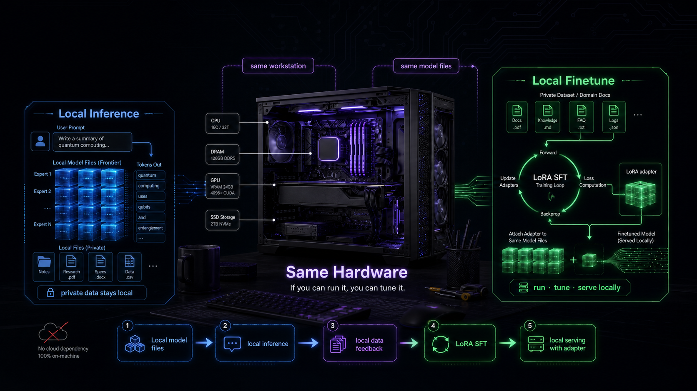
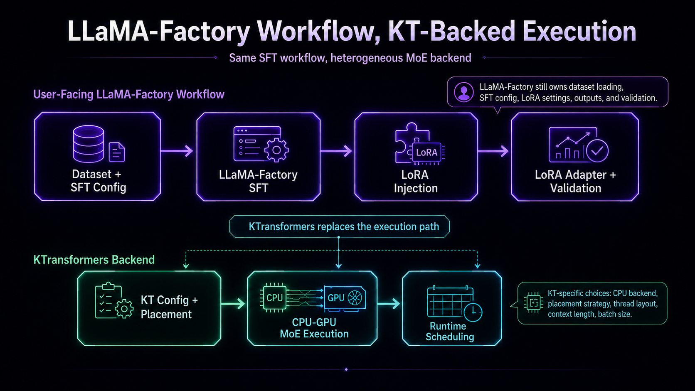
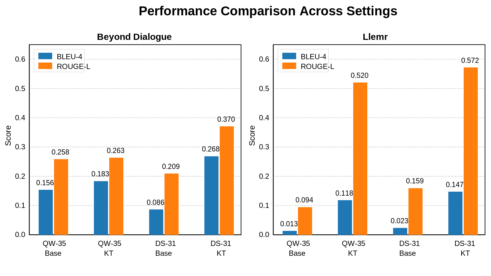

## Overview

[KTransformers](https://github.com/kvcache-ai/ktransformers) starts from a simple observation: different parts of a large [MoE](https://huggingface.co/blog/moe) (Mixture of Experts) model behave differently. Attention and shared experts are used all the time, so they need fast GPU compute. Routed experts are different: there are many of them, but each token only uses a few. KTransformers matches this model structure to the hardware in a local machine: GPU for the hot parts, CPU and DRAM for the large sparse parts, and a runtime that schedules both sides as one system.

Once inference becomes practical, the next question is natural: can developers also adapt those large models to their own data?

That is the simple idea behind KT fine-tuning: if you can run it, you should be able to tune it.

Local inference gives developers access to a large model. SFT, or supervised fine-tuning, goes one step further: it lets teams turn that model into something more useful for their own data, tasks, style, product, or research domain. But training is harder than inference. Even when a model can be served with heterogeneous execution, SFT still has to handle activations, gradients, and training state. For very large MoE models, that can push ordinary GPU setups past their limit.

KTransformers brings the same system idea from inference into SFT, while keeping [LLaMA-Factory](https://github.com/hiyouga/LLaMA-Factory) as the familiar training interface. Instead of treating training as a GPU-only job, KT lets the LLaMA-Factory workflow run on a CPU-GPU heterogeneous backend: GPUs handle the latency-sensitive attention path, while the heavy MoE expert path can be placed on CPU backends such as AMX or llamafile. Users still write normal SFT configs; when using LoRA, they get normal LoRA adapter outputs.

The result is a practical SFT path for larger MoE models, including models that would otherwise be too large to adapt on accessible hardware.

## Why KT-SFT matters

KT-SFT matters for the same reason KT inference matters, but training makes the problem harder. For inference, the main challenge is running a model that is too large to keep fully on GPU. For fine-tuning, the system also has to deal with activations, gradients, and training state.

Most fine-tuning tools still assume that the model can mostly stay in GPU memory during training. That assumption breaks for very large MoE models. The attention part may fit, but the full set of expert weights is often too large for ordinary GPU setups.

This is the key difficulty with MoE fine-tuning: the model does not use every expert for every token, but the machine still has to store all of those experts somewhere. A GPU-only training stack usually tries to keep too much of that weight set in VRAM. On large MoE models, that can fail before training really begins.

KTransformers fine-tuning tackles this problem by deciding where different parts of the model should live during training, instead of assuming everything has to sit in GPU memory.

The goal is simple: users should still write familiar fine-tuning configs and get normal LoRA adapters, while KT changes the backend so larger MoE models can fit the hardware they already have.

## The headline result: hardware stops being the blocker

The result in one sentence:

KTransformers does not just make MoE fine-tuning faster. It makes a class of MoE fine-tuning jobs possible on machines that would otherwise be out of the conversation.

In our LLaMA-Factory integration tests, KTransformers was evaluated against Hugging Face and Unsloth-style LoRA paths on representative MoE models. The pattern is evident.

| LoRA BF16 SFT setting | Hugging Face backend | Unsloth backend | KTransformers backend |
| --- | ---: | ---: | ---: |
| DeepSeek-V2-Lite 14B throughput | 303.58 token/s | 455.37 token/s | 530.38 token/s |
| DeepSeek-V2-Lite 14B GPU memory | 32.12 GB | 9.64 GB | 6.08 GB |
| DeepSeek-V3 671B throughput | Too large to run | Not supported | 40.35 token/s |
| DeepSeek-V3 671B GPU memory pressure | about 1400 GB theoretical FP16 footprint | Not supported | 70 GB measured peak |

The 14B result shows that KTransformers is not only for the largest models. Even when other systems can run, KT can reduce GPU memory use and improve throughput.

The 671B result is the stronger signal: with KT, a fine-tuning job can move from "too large to run" to actually running.

## We kept the LLaMA-Factory workflow intact

KTransformers sits underneath LLaMA-Factory instead of replacing it. The integration work is tracked in [PR #10430](https://github.com/hiyouga/LLaMA-Factory/pull/10430), and LLaMA-Factory still owns the parts users already expect:

* dataset loading and SFT configuration
* LoRA settings, training schedule, and adapter outputs
* output management, metadata, and quick validation paths

From the user's point of view, a KT-backed run is still a normal SFT job. The KT-specific choices, such as CPU backend, placement strategy, thread layout, context length, and batch size, become part of the training configuration.

At a high level, the workflow looks like this:

LLaMA-Factory stays responsible for the training workflow. KTransformers handles the execution path that makes large MoE training fit the machine.

## What KTransformers changes in the training path

Under that familiar workflow, KTransformers changes the part that matters most for large MoE models: where the computation and weights live during training.

The central idea is explicit placement. Instead of moving the whole model to one GPU, or replicating it across GPUs, KT lets the training stack construct and execute different parts of the model where they fit best:

* Attention-heavy parts stay on GPU and continue to work with LoRA injection.
* Routed expert weights can stay in CPU memory instead of occupying GPU VRAM.
* MoE expert computation is exposed to the training graph as a differentiable backend operator, so gradients and LoRA state still flow through the SFT job.
* CPU backends such as AMX BF16 or AMX INT8 paths can execute the heavy expert work.
* Multi-GPU training uses placement strategy instead of ordinary data parallel replication of the full model.
* KT configuration is passed into the transformers and accelerate execution path before training starts.
* The same CPU-GPU split used for KT inference carries into SFT.

MoE models already split dense attention from sparse expert compute. KT turns that split into a practical training layout: the full model no longer has to behave like a GPU-resident dense model, while the SFT workflow still produces a normal LoRA adapter.

## The adapter actually changes model behavior

Making a large training job runnable is only useful if the resulting adapter actually changes model behavior.

We tested KTransformers-backed LoRA fine-tuning on two adaptation workloads: [Beyond Dialogue](https://aclanthology.org/2025.acl-long.586/) for personalized chat, and [Llemr](https://papers.nips.cc/paper_files/paper/2024/hash/62986e0a78780fe5f17b495aeded5bab-Abstract-Datasets_and_Benchmarks_Track.html) for domain-specific EHR adaptation. Base is the original model, and KT is the KTransformers-backed fine-tuned setting.

These are representative small-scale evaluations rather than a universal claim. What they do show is the system property we care about:

KT can support real adapter training, not just loading a huge model for a demonstration.

## The trained adapter can be tested right away

The output of a KT-backed SFT run is still a normal LoRA adapter. After training, users can load that adapter with the base model and try it right away. They can check whether the model answers differently, compare it with the original model, and decide whether to adjust the dataset or LoRA settings for another run.

In our workflow, that validation usually happens through an SGLang serving path. The trained adapter is loaded with the base model, then checked through the same kind of chat, API, or application-facing evaluation loop that will be used after fine-tuning.

The important point is continuity. KT fine-tuning produces an adapter that can go straight into the same local validation loop: train, load, test, revise.

For large MoE models, that continuity depends on the same system idea as training. GPU memory is still limited, CPU memory still matters, and placement still decides what can run. KTransformers keeps that CPU-GPU execution model available after fine-tuning, so the adapter can be evaluated on the same class of hardware that made the SFT job possible in the first place.

## Closing remarks

KTransformers makes large MoE fine-tuning something a team can try on workstation-class hardware. For smaller MoE models, the benefit is better memory efficiency and stronger throughput. For very large MoE models, the benefit is access to a LoRA SFT path that would normally require much heavier infrastructure.

The same system idea carries from KT inference into KT fine-tuning: the model is heterogeneous, the hardware is heterogeneous, and the runtime connects the two. GPUs handle hot compute. CPU memory and CPU kernels carry the sparse expert side. Placement and scheduling turn the workstation into one coordinated system.

If you can run it, you should be able to tune it.
