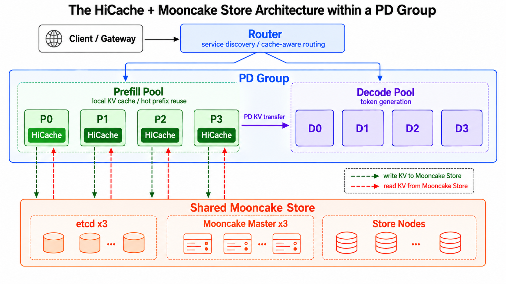

This article was contributed by **Approaching.AI**, sharing how it uses **Mooncake** to build large-scale LLM inference infrastructure that reliably produces more than one trillion tokens per day with trillion-parameter models.

## Prologue

Whoever can turn the same compute resources into more AI tokens, with higher quality and greater reliability, has greater AI productivity. As agents evolve from single-turn question answering to continuous planning, tool use, and multi-turn execution, token demand is shifting from sporadic API calls to sustained, large-scale production. In its production deployment of leading trillion-parameter models, Approaching.AI now consistently produces more than one trillion high-quality AI tokens per day. Since February 2026, average token production efficiency per node has improved more than threefold, while total production capacity has grown more than thirtyfold. Behind this large-scale production is a series of system-level optimizations spanning inference engines, scheduling, caching, and infrastructure, with Mooncake playing a key role.

## Background

The costs of a token factory are relatively fixed: spending on hardware purchases and rentals, electricity, data centers, and networking is largely fixed, while revenue depends on **token output × price per token**. The price per token, in turn, is directly tied to service quality: metrics such as TTFT, TPOT, and reliability determine whether those tokens can be delivered at a high standard.

Our goal is therefore clear: **maximize system throughput and token output per unit of compute while strictly meeting SLOs.** In other words, no performance optimization can come at the expense of SLOs.

The rapid growth of agentic workloads makes this tension even more pronounced. Coding agents, multi-turn reasoning, and tool calls repeatedly reuse long contexts. KV cache hits can substantially reduce prefill computation, whereas a single cache miss can mean recomputing hundreds of thousands of tokens. Beyond wasting compute, this can significantly increase response times and even block normal responses to other requests.

At Approaching.AI, this is already a trillion-token-scale problem. Our production inference system must reliably produce **more than one trillion tokens every day**. At this scale, even wasting just a few percent of compute can translate into enormous infrastructure costs. In a trillion-token-scale factory, the KV cache is no longer merely an optional, local optimization; it has become critical infrastructure that affects overall production capacity and cost.

**A major challenge we face is how to turn the KV cache from a per-node resource into a shared, cluster-wide resource, improving cache hit rates and system throughput while still meeting strict SLOs.**

## From Local Caching to Global KV Cache Pooling

The KV cache becomes even more valuable in agentic and long-context scenarios. But relying solely on GPU HBM creates an inherent trade-off for KV cache reuse: allocating too little cache space lowers hit rates and forces extensive recomputation of historical context; allocating too much consumes GPU memory needed to process requests, reducing the efficiency of new-token computation. This trade-off is especially pronounced with extremely long contexts.

We therefore first introduced **SGLang HiCache** into production, adding higher-capacity host DRAM to the KV cache hierarchy. This significantly increased both available KV cache capacity and hit rates without materially affecting GPU compute efficiency.

However, as the system expanded to more than one trillion tokens per day, the limits of per-node caching quickly became apparent.

On the one hand, a single node's DRAM capacity is ultimately limited, and duplicate KV cache data scattered across different nodes cannot be shared. On the other hand, for certain KV cache structures, the HiCache architecture at the time stored separate copies on multiple TP ranks within the same node, resulting in up to eightfold data redundancy on a single node. These issues left cache hit rates well below the ideal.

More importantly, **per-node local caching effectively binds the location of the KV cache to the location where a request executes.**

When most of the KV cache for a session’s requests resides only on specific prefill nodes, reusing that cache requires routing the session’s subsequent requests back to those same nodes. As a result, scheduling decisions that should otherwise be driven by real-time load, request characteristics, and resource availability become constrained by where the cache resides.

In other words, if the KV cache remains private to each node, cache reuse and cluster scheduling are coupled: **every expansion of the scheduler's set of choices may come at the cost of lower cache hit rates, more recomputation, or even SLO violations.** As the cluster grows, this coupling limits not only the benefits of resource pooling but also the design space for scheduling algorithms. It becomes difficult to move requests flexibly in response to real-time conditions such as traffic fluctuations and node failures, or to make finer-grained scheduling decisions based on context length, cache hits, compute characteristics, and the hardware characteristics of different compute nodes.

Consider load balancing. To improve hit rates, continuously routing requests with the same prefix to a small number of prefill nodes can occasionally concentrate popular requests on a single node. Requests then accumulate and queue on that node, violating the TTFT SLO. But moving requests to other nodes to alleviate the hotspot triggers substantial recomputation because the KV cache cannot be reused across nodes. During peak periods, this may even spread the pressure to the new nodes.

For a trillion-token-scale factory, this is no longer just a matter of a few percentage points in cache hit rate. It is a system-level issue that directly affects **cluster scheduling flexibility, peak throughput capacity, resilience to failures, and the ability to meet SLOs**.

We therefore introduced **Mooncake Store** to pool the KV cache previously distributed across individual nodes into a shared, cluster-wide resource.

We aimed to achieve three things simultaneously:

* Further improve KV cache hit rates;
* Remove the constraints that KV cache placement imposes on cluster scheduling;
* Avoid introducing additional performance overhead or system risks into the inference critical path.

**Architecturally, SGLang HiCache together with Mooncake Store naturally addresses the first two goals. The real challenge lies in the third: a cache system must be fast and stable enough that it never slows down, or even brings down, the inference system.** This has been the central engineering challenge over the past six months as we pushed Mooncake into trillion-token-scale production environments.

Below, we first describe the overall deployment architecture, then explain how we addressed these core challenges.

## SGLang + Mooncake in Production: Architecture and Practice

Once the KV cache becomes a shared, cluster-wide resource rather than a per-node resource, it is no longer just a caching system, but something that must be co-designed with compute, networking, and scheduling.

### Architecture Overview

Approaching.AI's production inference system consists of multiple groups, each containing several GPU nodes and using RDMA for high-speed KV cache transfers. Requests are first distributed at the gateway layer, then routed to a specific group according to a routing policy. The following discussion focuses on how SGLang + Mooncake is deployed within a single group.

Within each group, we use a disaggregated prefill-decode deployment and enable HiCache only on prefill nodes. This is because the main computational cost of long-context requests lies in the prefill phase, where cache hits directly eliminate substantial recomputation before the first token is generated. The decode phase prioritizes stable, low-latency, token-by-token generation, so we focus on keeping the decode path simple and stable.

### Mooncake Store: Turning Node Memory into a Shared KV Cache Pool

Mooncake Store runs as an independent Store Service on all prefill and decode nodes.

On decode nodes, host memory is primarily used by Mooncake Store; on prefill nodes, memory is shared between HiCache and Mooncake Store. This organizes DRAM previously scattered across nodes into a larger distributed KV cache pool, providing the foundation for cross-node reuse.

The Mooncake client embedded in HiCache on each prefill node is configured not to contribute storage to the global cache. Instead, separate Store Service processes provide that storage, decoupling the inference engine from the cache system so that each can be upgraded or scaled independently. To account for the NUMA topology of our servers, each of which has two NUMA nodes, we pin one Mooncake Store Service to each NUMA node. This preserves NUMA affinity for local KV cache access and network transfers as much as possible, reduces cross-NUMA access overhead, and fully utilizes the topology-aware transfer capabilities of Mooncake Transfer Engine.

On the control plane, Mooncake Master is configured with three replicas—one primary and two standbys—deployed across three GPU nodes. The etcd service that Mooncake depends on also uses three replicas and runs on dedicated CPU nodes alongside other cluster management components.

### Cluster Scheduling with SMG

A shared KV cache alone is not enough. Cache pooling expands the set of nodes to which requests can be scheduled, but the scheduler still needs to make sound decisions that balance cache locality, real-time load, node health, and request characteristics. For example, pursuing cache locality solely to reduce cross-node network transfers can repeatedly send requests with the same prefix to a small number of prefill nodes, eventually creating hotspots. Focusing only on load balancing, however, can frequently move requests to nodes with colder caches, increasing remote accesses or even recomputation.

Our intra-group request scheduling is based on **SMG (SGLang Model Gateway)**, with improvements tailored to production conditions. On the prefill side, the scheduler considers information such as HiCache's local hit rate, real-time node load, node health, and request characteristics. While meeting SLOs, it seeks to maximize overall system throughput and reduce request TTFT.

On the decode side, where the focus is on throughput and stable tail latency during ongoing generation, the scheduler distributes generation load as evenly as possible across multiple decode instances.

### Production Orchestration with RBG

At the Kubernetes layer, we use **RBG (RoleBasedGroup)** to manage SGLang and Mooncake workloads together. RBG provides topology definitions and coordination policies for different application roles, allowing prefill, decode, Mooncake Store, and other roles to be deployed and managed as a unit. As a foundational metadata component, etcd runs independently and is not managed by RBG.

## Bringing Mooncake to a Trillion-Token-Scale Factory

To bring Mooncake into a production environment generating more than one trillion tokens per day, the central question was not just whether the KV cache could be shared, but **whether Mooncake could keep pace with the token factory's exceptionally demanding performance and stability requirements**. SGLang HiCache + Mooncake Store addresses cache hit rates and cross-node scheduling at the architectural level, but only if this cache infrastructure is sufficiently fast and stable to avoid introducing new performance overhead or system risks into the inference path.

Since February 2026, Approaching.AI's average AI token production efficiency per node has improved more than threefold, and total token production capacity has grown more than thirtyfold. KV cache hit rates have also improved significantly, remaining consistently above 90%. This means Mooncake must handle KV cache throughput that has increased severalfold on each node while continuing to expand the number of inference nodes a single cluster can support. **Every improvement in token production efficiency at the application layer demands a corresponding advance in the underlying cache system. Over the past six months, this has been the “sword of Damocles” hanging over our production optimization of Mooncake.**

### Fast Data Retrieval: Hiding Remote KV Cache Reads Behind Computation

KV cache reuse primarily occurs during prefill. For a prefill request, HiCache first checks the local cache. For local misses, it queries Mooncake Master via RPC to retrieve metadata for the corresponding KV cache, then uses RDMA to fetch available data in parallel from multiple Mooncake Store nodes. Only after the data is ready does the request proceed to the GPU for the remaining prefill computation. Once prefill completes, newly computed KV cache data that does not yet exist in Mooncake is written back to Store for reuse by subsequent requests. As KV cache data is continuously written, Mooncake Master must also continuously maintain metadata and perform LRU eviction.

For production inference, retrieval speed is critical. HiCache asynchronously initiates remote KV cache prefetching as early as possible after a request enters the scheduling queue, overlapping network transfers with computation already running on the GPU. Mooncake therefore needs to ensure that **KV cache retrieval is hidden as much as possible behind the execution time of preceding requests**. As long as remote data is ready before the GPU begins processing the current request, the additional overhead Mooncake Store imposes on the inference engine is almost imperceptible. Conversely, if data retrieval falls behind the scheduling cadence, the GPU must wait for the KV cache to arrive, and the cache system creates new idle time and TTFT overhead.

Mooncake's batched-read data path is straightforward: a single Master RPC query locates the cached data, followed by direct parallel RDMA reads from multiple Store nodes. Read performance therefore depends primarily on two factors: Master RPC query latency and throughput, and RDMA transfer efficiency, which in turn depends on both network bandwidth and Transfer Engine performance. Our production deployments typically use high-performance 800 Gbps NICs. Combined with Transfer Engine's architectural strengths, such as multi-NIC pooling and topology-aware path selection, this means we have not observed RDMA data transfers becoming the primary performance bottleneck under our current production network configuration and workload characteristics. After optimizing the first factor, average latency for batched KV cache read requests in production is below 50 milliseconds, with the vast majority completing within 100 milliseconds. This keeps remote KV cache reuse off the GPU's critical waiting path as much as possible.

### Scaling to Larger Clusters

After pooling the KV cache across the cluster, we wanted each Mooncake cluster to serve as many prefill and decode nodes as possible. Larger groups mean a wider scope for cache reuse, greater capacity to absorb traffic fluctuations, and more room for scheduling and optimization.

We scaled incrementally rather than attempting to reach the target size in a single step. We first validated stability in small groups, then expanded the scale in a test cluster for long-duration stability testing, continuously monitoring performance and stability bottlenecks. Once issues were resolved, we moved to a production canary rollout, followed by full deployment after confirming stability. We then used that deployment as the basis for expanding to still larger groups. Through this process of staged validation and incremental expansion, we turned cluster scaling itself into a controlled, repeatable engineering process.

Along the way, we encountered many issues and challenges.

**The first was performance bottlenecks in the Master service.** Data in Mooncake Master is hashed into 1,024 shards, each with its own read-write lock to control concurrent access. As Store cache capacity and concurrent requests increase, Master must handle more frequent metadata queries, while periodically triggered LRU eviction operations also take longer. During eviction, the eviction thread acquires each shard's write lock in turn. If there is too much metadata, it holds the shard's write lock for an extended period, blocking read and write requests and significantly increasing request latency during eviction.

We addressed this in two ways: improving eviction efficiency and reducing lock contention between eviction and read/write requests. For the former, we substantially reduced overhead from string copies, object construction, and memory allocation. We also enhanced the write mechanism to allow multiple ranks of the inference engine to write to different offsets within the same object, greatly reducing the number of cached objects. For the latter, we first moved time-consuming operations such as replica destruction and memory deallocation out of the write-lock critical section during eviction, shortening the time the lock is held. We then further refined locking from shard granularity to object granularity, substantially reducing contention.

**The second was scaling performance.** When a Store node comes online, it must allocate several terabytes of memory and register that memory with multiple RDMA NICs. When it goes offline, the memory must be deregistered from those NICs and freed. This process is very time-consuming. We optimized memory initialization and RDMA registration, achieving severalfold performance improvements, then added huge page support to further reduce the time spent on memory allocation, registration, deregistration, and deallocation.

On the Master side, taking a Store node offline previously required traversing all shards to remove the metadata associated with that node. Otherwise, subsequent requests would attempt to read data from the offline node and fail. With large amounts of metadata, this process could take a long time, significantly delaying node removal. We addressed this by splitting node removal into two phases: “synchronous invalidation, asynchronous cleanup.” We first remove the segment from the allocation pool and mark it as going offline, preventing subsequent requests from attempting to read or write the node's data. A background thread then cleans up the metadata. This reduced the time needed for Master to complete a node-removal request to milliseconds.

**The third was networking issues during KV cache transfers.** Most of our clusters use RoCE networking with RTT-based congestion control enabled. Mooncake-based prefill-decode disaggregation and KV cache reuse generate substantial KV cache transfer traffic. In production, we observed frequent all-to-all microbursts with incast, visible spikes in ECN/CNP packets, and increased PFC counters caused by congestion within servers. After long-term monitoring and testing, however, we concluded that these phenomena do not significantly affect KV cache transfer speeds or production metrics such as TTFT, and do not impact inference cluster throughput.

For KV cache transfers, network stability and jitter in production deserve more attention than network performance itself. We found that many failures were unrelated to the Mooncake Transfer Engine implementation and instead stemmed from cluster configuration. For example, OVS configuration, routing configuration, IOMMU configuration, inconsistencies in NIC firmware and drivers, and Kubernetes networking failures can all cause Mooncake Transfer Engine errors. Troubleshooting RDMA network errors therefore requires investigating potential failure points across the entire path, rather than focusing solely on connectivity tests such as nccl-tests.

### Cluster Stability and Safety: Containing the Blast Radius of Failures

For large-scale inference clusters, performance determines the system's upper limit, while stability determines whether that limit can be confidently used in production.

As clusters grow, hardware failures, network jitter, process errors, and configuration mistakes gradually shift from rare events to everyday occurrences. Mooncake Store also sits on the shared KV cache data path: if cache system failures propagate to the inference engine, an issue confined to a single Store node, NIC, or transfer link can escalate into blocked requests, TTFT fluctuations, or even reduced availability across the entire inference cluster.

During the early stages of deploying Mooncake, we therefore took a conservative approach to stability: **the distributed KV cache service may become temporarily unavailable, but it must not disrupt the inference service itself; local failures may occur, but they must not escalate into cluster-wide failures.**

Following this principle, we added safeguards for cluster isolation, network isolation, timeouts and circuit breaking, and data allocation policies. Some of these measures were deliberately overcautious during the initial rollout. As Mooncake and the cluster network environment become more stable, they can be simplified or removed as appropriate based on operational experience. During rapid system expansion, however, these mechanisms helped us control the risks and failure blast radius introduced by new infrastructure.

First, instead of having all inference nodes share one enormous Mooncake Store cluster, we retained the inference system's group boundaries and deployed an independent Mooncake Store cluster in each group. Cache services are isolated across groups. Even if an entire group's Mooncake Store becomes unavailable, the impact remains confined to that group and does not affect KV cache services in other groups. This sacrifices some potential benefits of cross-group cache sharing, but provides clearer failure domains and makes canary upgrades, scaling, and failure handling more controllable.

Second, we further isolated the network resources used by Mooncake. In production, prefill-decode disaggregation already requires RDMA transfers between prefill and decode nodes, while Mooncake Store introduces another substantial stream of KV cache read and write traffic. If both traffic types fully share the same NICs and Transfer Engine, abnormal traffic, resource contention, or a Transfer Engine failure on either side could affect the other. During the initial rollout, we therefore assigned dedicated NICs to Mooncake Store and used separate Transfer Engine instances for Store and prefill-decode disaggregation, breaking failure propagation paths at both the data-plane and software-instance levels as much as possible.

An even more important safeguard comes from **timeouts and circuit breaking**. HiCache already provides a read timeout mechanism: when a KV cache read from Mooncake exceeds a configurable threshold, HiCache stops waiting for unfinished transfers, uses only the cache data already retrieved successfully, and recomputes the remainder. This ensures that even a remote read with long-tail latency does not block prefill computation.

On top of this, we added a **Mooncake Store cluster-level circuit breaker**. When the system detects persistent errors or unavailability in a Store cluster, it can automatically disconnect HiCache from Mooncake Store, temporarily falling back to local-only KV caching so that inference can continue.

We also specifically optimized the KV cache data allocation policy to reduce the blast radius of a single-node failure. Under Mooncake's default allocation policy, KV cache data is assigned to Store nodes at random, scattering a long request's KV cache across almost all nodes. If any node fails and a block in the middle of the KV cache is lost, subsequent cached blocks can no longer be used for prefix reuse even if they remain available, amplifying the impact of the failure. Random remote writes also increase cross-node network overhead and latency. We therefore implemented a new allocation policy: when writing KV cache data, Mooncake prefers the local Store. If local space is insufficient, it tries other nodes in a deterministic order. The order remains consistent for a given writer node, keeping a request's KV cache concentrated on the first few candidate nodes as much as possible. Different writer nodes use different orders to maintain load balancing.

## Future Work

SGLang HiCache + Mooncake now reliably supports Approaching.AI's production of more than one trillion tokens per day, but there is still room to optimize cache capacity, the scope of cache reuse, and hardware configurations. We will focus on the following directions.

**Introducing SSDs as a Third Cache Tier.** In agentic workloads, KV cache lifetimes exhibit a long tail: most cached data quickly becomes obsolete, but a small portion is reused after a much longer interval. Keeping this data in expensive DRAM is not cost-effective. We plan to introduce SSDs as the next cache tier, asynchronously moving cold KV cache data from DRAM to SSDs. This will expand effective cache capacity while controlling costs and further improve KV cache hit rates.

**Federated Mooncake: Enabling Cross-Group KV Cache Reuse.** Our Mooncake Store clusters are currently deployed independently within each group. This architecture clearly isolates failure domains, but it also imposes artificial boundaries on KV cache reuse: even if the same prefix already exists in another group, a request entering a new group cannot reuse it directly. Going forward, we will continue to expand individual groups while also breaking down group boundaries. We plan to retain independent clusters while allowing Mooncake clients to query and read KV cache data across clusters when necessary. This would further improve global cache hit rates and give the router greater scheduling flexibility, so requests would no longer face a strict choice between a cache hit and cross-group scheduling. Cross-group sharing does, of course, introduce more complex metadata management and network traffic control, as well as greater risk of failure propagation. As we expand the scope of KV cache reuse, we must therefore also improve cross-cluster failure isolation and fault tolerance, ensuring that broader sharing does not come at the cost of a larger failure blast radius.

**Supporting Heterogeneous Inference Clusters.** As inference infrastructure evolves, token factories will no longer consist solely of fully homogeneous GPU nodes. We plan to support more flexible heterogeneous deployments, such as using different accelerators for prefill and decode nodes. As shared KV cache infrastructure connecting different compute nodes, Mooncake can further loosen the coupling between inference services and specific compute devices. By further decoupling computation, transfers, and caching, tasks at different stages can be dynamically assigned to the compute resources best suited to the workload's characteristics.

## Acknowledgments

We thank the Mooncake and SGLang communities for their generous help and support throughout Approaching.AI's production deployment and ongoing optimization efforts.

The Mooncake optimizations and improvements discussed in this article are being progressively contributed back to the open-source community.

## Related Links

Approaching.AI: https://approaching-ai.com/en/

Mooncake project: https://github.com/kvcache-ai/Mooncake

SGLang project: https://github.com/sgl-project/sglang