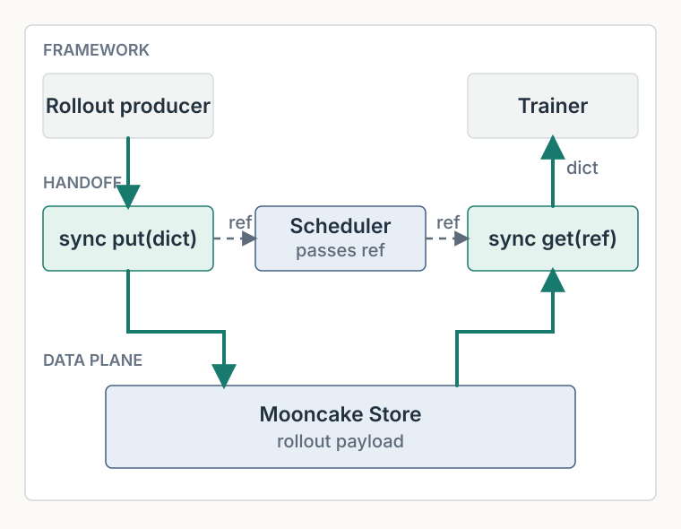
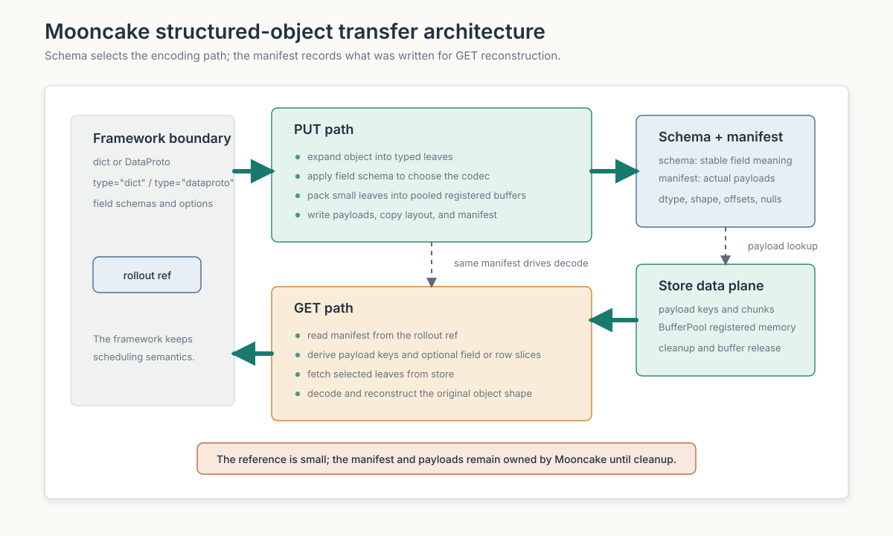
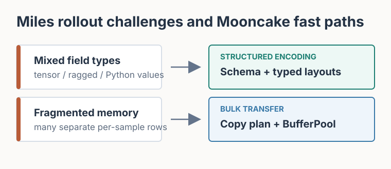
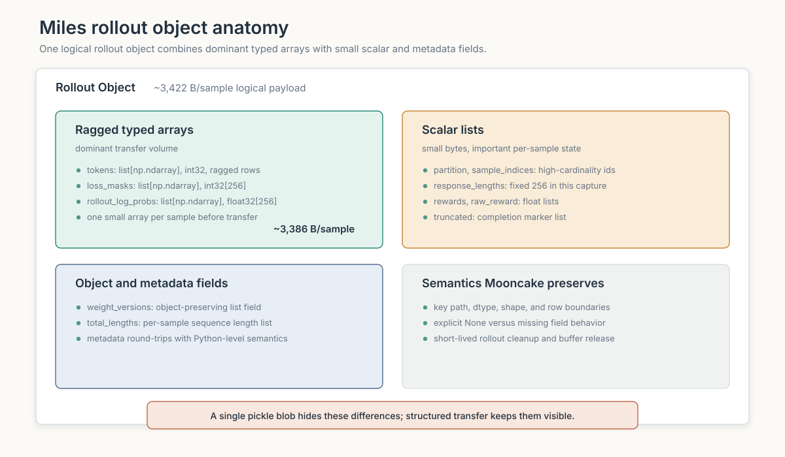
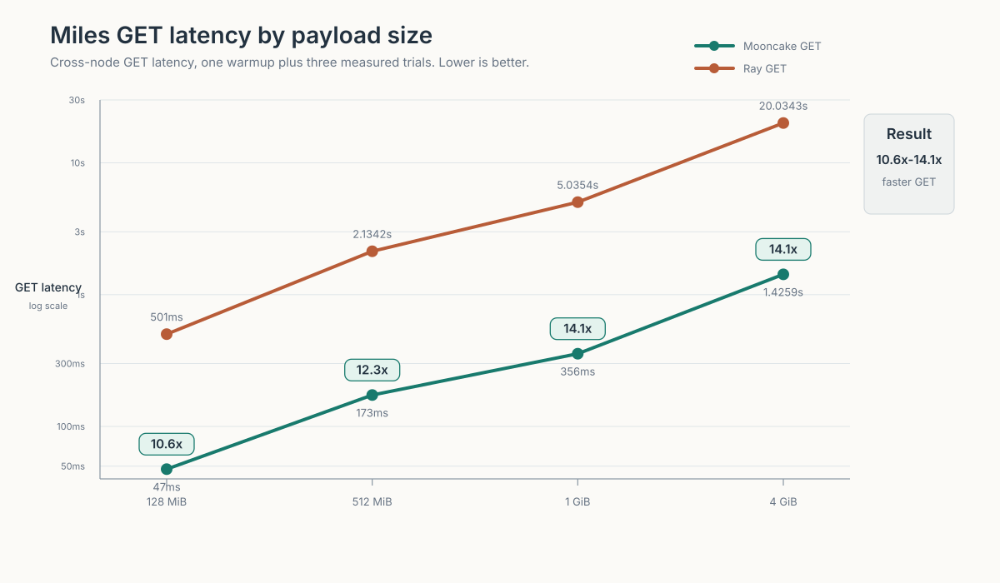

## Rollout Data in Disaggregated RL Systems

Reinforcement learning for large language models combines two very different workloads: **rollout generation** and **model training**.

During rollout, inference workers run the current policy on a set of prompts and generate responses. Along the way, they produce the information required by the learning algorithm, including generated tokens, masks, log probabilities, rewards, sequence lengths, sample identifiers, and other metadata. Together, these outputs form the **rollout data** that will be consumed by the next training step.

At small scale, generation and training can share the same execution environment. At larger scale, however, modern RL systems increasingly adopt a **disaggregated architecture**, where rollout generation and training are deployed as separate worker groups, often across different processes, GPUs, or machines.

The two stages have fundamentally different resource and execution characteristics. Rollout is an inference-heavy workload whose throughput depends on decoding efficiency, batching, and request scheduling, while training relies on large, highly synchronized tensor computations. Separating them allows each side to be scaled and scheduled independently instead of forcing both workloads into the same execution pattern.

This separation also enables **pipeline-level concurrency**. Miles can train on rollout *N* while rollout workers are already generating rollout *N+1*. Asynchronous RL systems can therefore allow rollout and training workers to progress at different rates rather than making one stage wait for the other after every operation.
The benefit is better resource utilization and greater flexibility in how inference and training capacity are provisioned. But disaggregation also introduces a new systems boundary: **the data produced by rollout workers must now move to a different set of workers before training can consume it**.

That handoff sits directly between generation and the next policy update. A slow transfer can leave trainers waiting for data and keep memory occupied on rollout workers longer than necessary. For a distributed RL system such as Miles, efficiently moving this **structured rollout data from the inference side to the training side** therefore becomes an important part of the end-to-end RL pipeline.

## What Makes RL Rollout Data Transfer Challenging

RL rollout data differs significantly from the large, regular tensors commonly moved in distributed training.

A rollout batch is usually a **heterogeneous structured object** rather than a single contiguous tensor. Depending on the framework and algorithm, it may contain generated tokens, loss masks, log probabilities, rewards, sequence lengths, sample identifiers, routing information, metadata, and other auxiliary fields. These values can be represented as tensors, NumPy arrays, Python scalar lists, variable-length per-sample arrays, bytes, or arbitrary Python objects.

Several properties make this data particularly challenging to move efficiently.

**Challenge 1: Heterogeneous Data Types and Complex Semantics**

Different rollout fields have fundamentally different representations and semantics. Dense tensors and numeric arrays can be transferred efficiently as typed buffers, while ragged sequences need row-boundary information, scalar lists need their original values preserved, and metadata or Python objects may require more general encoding. At the same time, the trainer must reconstruct the exact structure expected by the RL framework, including dtype, shape, row order, null state, and metadata. A generic serializer can handle these objects functionally, but often at the cost of extra conversion, copying, and reconstruction. Efficient rollout transfer therefore needs to understand both the physical representation and the logical structure of each field.

**Challenge 2: Highly Fragmented Memory Layout**

Rollout data can contain a very large number of small memory allocations. In the captured Miles workload, major fields such as tokens, loss_masks, and rollout_log_probs are represented as list[np.ndarray], with one NumPy array allocated for each sample. As batch size grows, transferring these fragments individually introduces repeated memory registration and Store operations, while serializing the full Python object requires walking, copying, and rebuilding a large object graph. The challenge is to turn fragmented logical data into efficient bulk transfers without losing its original structure.

**Challenge 3: Incremental Production and Partial Consumption**

In asynchronous RL pipelines, rollout data may not become ready all at once. Different DataProto fields may be completed at different times for the same rows, while new row groups may also arrive later. An efficient data path should allow producers to publish newly completed fields or rows without rewriting payloads that have already been transferred. On the consumer side, different workers may only need a subset of the available fields or rows, so they should be able to fetch only the data they actually need instead of materializing the full object every time. Mooncake supports this through its DataProto path; the current Miles integration uses the simpler completed-dict handoff described below.

Together, these challenges make rollout data movement more than a bandwidth problem: the system must efficiently move fragmented, heterogeneous data while preserving its structure and supporting incremental production and selective consumption.

An effective data path needs to satisfy several requirements at the same time:

* **Efficiency:** avoid excessive serialization, copying, object reconstruction, and per-allocation transfer overhead.
* **Correctness:** preserve field types, shapes, row boundaries, null state, metadata, and Python-level values through the round trip.
* **Scalability:** continue to perform well as the number of samples, object fragments, and total payload size increase.
* **Flexibility:** support heterogeneous fields without forcing the RL framework to flatten or rewrite its native rollout representation.
* **Predictable handoff latency:** deliver the batch quickly enough that the trainer does not stall waiting for rollout data.

## Powering Miles Rollout Data Transfer with Mooncake

**Miles** is a high-performance reinforcement learning framework for large-scale model post-training. It combines **SGLang for high-throughput rollout generation** with **Megatron-LM for scalable training**, and also provides a PyTorch FSDP2 backend for workloads that prefer to train Hugging Face model implementations directly. Miles supports fully asynchronous RL, where rollout and training workers are decoupled and can progress independently, together with features such as fast in-loop weight updates, agentic rollout, low-precision training, and fault tolerance for large-scale production RL workloads.

This disaggregated and asynchronous design makes the rollout-to-training data path a critical part of the RL pipeline. Rollout batches are structured and heterogeneous, often containing fragmented per-sample data and framework-specific metadata, making efficient transfer and reconstruction increasingly important as workload scale grows.

**Mooncake** provides a high-performance data plane for distributed AI workloads. For RL rollout data, it extends this data plane with structured-object transfer, allowing heterogeneous and fragmented rollout objects to be moved while preserving their original structure and semantics.

Mooncake has now been integrated into Miles as a rollout data-transfer backend. On rollout data captured from Miles, the integration delivers substantially lower transfer latency than the existing Ray path: remote GET is roughly **10–14× faster**, while PUT improves by about **1.2–1.6×**.

The result is a faster rollout-to-training handoff without changing the RL programming model, providing Miles with a more efficient data path for large, structured rollout workloads.

## How Rollout Data Moves Through the RL Pipeline

Miles supports both synchronous and asynchronous training loops. In either mode, once rollout workers and trainers are deployed in separate processes or on separate machines, each completed rollout batch must cross that boundary before it can be consumed by the next training step.

A useful design principle is to separate the **control plane** from the **data plane**. The framework scheduler decides where a rollout batch should go, but it should not carry the bulk payload itself. Instead, it passes a lightweight transfer reference that excludes tensor payloads and Store chunk layouts, while still allowing JSON-safe metadata when needed. The actual rollout payload takes a separate path:

* the framework scheduler passes the transfer reference;
* Mooncake stores and transfers the payload;
* the training worker reconstructs the original object before running the training step;
* after all readers finish, the framework removes the short-lived Store object.

This separation keeps scheduling decisions lightweight while allowing the bulk rollout payload to move through a dedicated data path.

### What Miles Actually Transfers

The rollout data captured from **Miles** makes this data path concrete. For a given framework configuration, the field contract is stable, but the fields do not share one convenient in-memory representation. They fall into three broad groups:

| Field Group | Miles Representation | Transfer Concern |
| --- | --- | --- |
| Token, mask, and log-probability rows | Per-sample numeric rows | Many separate row objects; lengths may differ by sample. |
| IDs, lengths, rewards, and flags | Python scalar lists | Small in bytes but required by training. |
| Optional and object metadata | Python values, tensor dictionaries, or nested objects | Preserve structure, nulls, and enabled-feature semantics. |

The first group carries most of the bytes in our capture. The other fields are smaller, but they cannot be discarded or normalized away: they carry sample identity, lengths, rewards, feature state, and bookkeeping information. Their exact size depends on the workload; the benchmark section gives one measured example.

### Two Rollout Handoff Protocols

Above the Store data plane, rollout data can follow different handoff protocols. Here, **protocol** refers to when an object becomes visible to consumers and what a reader is allowed to request—not whether the underlying bytes move over RDMA or TCP.

#### Flat Dict: Completed-Object Handoff

In **Miles**, the current handoff begins after the complete rollout dictionary is ready. The producer calls `put(data, type="dict")`, the scheduler carries the returned reference, and the trainer calls `get` to reconstruct the original dictionary.

*Figure 1. Miles uses synchronous `put` and `get` for a completed rollout dict. The reference travels through the scheduler, while Mooncake moves the payload through the Store data plane.*

The individual transfer calls are synchronous. The producer returns the reference only after `put` completes, and the trainer waits for `get` to finish before consuming the object.

This does not prevent the RL pipeline itself from being asynchronous. Miles can generate rollout *N+1* while training on rollout *N*. In other words, the concurrency sits above the transfer operation: each individual handoff is synchronous, while different rollout and training stages can overlap at the pipeline level.

#### DataProto: Incremental Publication and Partial Reads

Some RL pipelines need finer-grained handoff than a completed rollout dictionary. The **DataProto** path preserves three explicit sections:

* `batch` for row-aligned tensor fields;
* `non_tensor_batch` for row-aligned non-tensor fields;
* `meta_info` for object-level values.

Unlike the completed-object handoff, DataProto allows rollout data to become visible incrementally in two dimensions.

**Fields may arrive later for the same rows.** `append_dataproto_fields()` writes a new structured object containing the newly completed fields and returns an updated handle. Existing payloads are not rewritten, and appended row-aligned fields must use the original batch size.

**New rows may arrive later.** Each completed row group is stored as a separate DataProto fragment using `put(..., type="dataproto")`. A framework index or `DataProtoCatalog` maps logical keys to fragment rows, allowing readers to compose the requested logical row order without physically extending an existing handle.

Consumers can also select **fields and rows together**. A worker that needs only two fields for part of a batch does not have to materialize the rest of the DataProto object. Mooncake skips unrequested members and, where the stored layout supports it, reads only the byte ranges corresponding to the selected rows.

*Figure 2. DataProto can grow logically by adding fields to existing rows or by publishing new row fragments. These are different operations: only the first uses `append_dataproto_fields()`. A partial GET materializes the intersection of the requested fields and rows.*

The individual operations remain synchronous. A newly published group becomes visible only after its PUT and index update complete, and GET returns only after the requested data has been materialized.

Pipeline-level asynchrony comes from publishing completed field groups or row groups at different times while other work continues. This allows rollout production, data movement, and downstream consumption to overlap without requiring each individual Store operation to become asynchronous.

## How Mooncake Preserves and Transfers Miles Rollout Data

Mooncake does not ask Miles to flatten or rewrite its rollout dict. The public path remains `put(data, type="dict")` and `get(ref, type="dict")`; the structured-object layer chooses the physical layout underneath. Its optimizations follow directly from the challenges above.

*Figure 3. Schema and leaf expansion expose each field's type and structure. Field-specific encoding produces typed payload members and reconstruction metadata; the Bundle Store publishes their manifest last. Eligible fragmented transfers use BufferPool-backed staging, and GET follows the same structure in reverse.*

### Choose a Layout for Each Field

Mooncake first expands the dict into leaves that can be encoded efficiently. Arrays and tensors remain typed, ragged rows carry compact boundary metadata, and supported Python values retain the information needed to reconstruct them. A framework-provided schema fixes the stored representation for ambiguous or performance-sensitive fields; when no schema is supplied, Mooncake infers one from the observed values.

The same choice applies to multimodal data. Processed pixels and related model inputs can stay on the tensor path. PIL images, encoded PNG or JPEG bytes, and variable-length media lists use media-aware layouts that preserve their boundaries and reconstruction metadata without forcing every representation through the same serializer.

### Turn Fragmented Memory into Bulk I/O

Sending every row separately creates thousands of registrations and Store requests. Concatenating a whole field first avoids that request count, but adds a full-size temporary. Mooncake instead builds a copy plan and fills reusable, registered BufferPool chunks as they are needed. Its native path copies eligible numeric rows directly into those chunks, avoiding Python row loops and temporary concatenations. Large contiguous arrays and tensors still use direct or native paths when the Store supports them.

### Publish Complete Bundles and Rebuild Directly

Mooncake publishes the bundle manifest only after all payloads and metadata are ready, so a reader never sees a half-written Miles dict. On GET, the manifest identifies the members to fetch and the structured metadata describes how to rebuild each field. Eligible reads can target BufferPool-backed destinations without an intermediate `bytes` object, and typed ragged rows can view the result buffer directly.

The trainer releases its local BufferPool-backed result after use. Once all readers finish, Miles removes the short-lived Store object and Mooncake reclaims its payload chunks and manifest.

*Figure 4. Each rollout data challenge maps to a specific structured-transfer optimization. Miles uses the completed-dict path; DataProto adds incremental publication and partial reads for pipelines that need them.*

## Performance Results

For a fixed framework configuration, switching models does not by itself change the field contract. Transfer size instead follows the number of samples, prompt and response lengths, and optional fields such as teacher log probabilities, routing information, or multimodal inputs.

### Benchmark Payload

Miles generated the source data with Qwen3-0.6B on math prompts (`rollout_id=0`, 8 source samples). Every response in this capture has 256 tokens. For the benchmark, the three large numeric fields were normalized to typed ndarray rows while preserving their values, row lengths, dtypes, and per-sample fragmentation. Averaged across those samples, the logical payload breaks down as follows:

| Part of One Captured Sample | Calculation | Logical Bytes |
| --- | ---: | ---: |
| `tokens` | Average prompt-plus-response token count x 4 B (`int32`) | ~1,338 B |
| `loss_masks` | 256 entries x 4 B (`int32`) | 1,024 B |
| `rollout_log_probs` | 256 entries x 4 B (`float32`) | 1,024 B |
| Scalar and object fields | IDs, lengths, rewards, flags, and version metadata | ~36 B |
| **Total** | | **~3,422 B** |

The first three fields account for about 3,386 bytes, or 98.9% of this particular sample layout. Larger benchmark payloads repeat the eight captured samples, preserving their field types and fragmented allocation pattern while increasing the logical sample count. The calculation describes this capture; it does not define a fixed Miles sample size.

_Figure 5. The measured composition of one sample in the Qwen3-0.6B benchmark capture._

### Transfer Results

The benchmark measures the completed flat-dict handoff used by Miles and compares the Miles Ray backend with Mooncake structured-object transfer.

PUT is one timed backend call after the producer loads the payload. GET is the mean of three remote-consumer trials after one warmup. Reference serialization and scheduler handoff are outside the timed region. These numbers cover payload transfer and reconstruction, not end-to-end training throughput.

Across the tested payload sizes, Mooncake makes Miles GET roughly 10–14x faster than the Ray backend. PUT improves by about 1.2–1.6x.

_Figure 6. Mooncake provides roughly 10–14x faster GET for this fragmented Miles rollout layout. The vertical axis uses a logarithmic scale._

PUT shows a smaller gain. Its timed path includes Python-object traversal, ragged-row packing, metadata and manifest construction, and payload transfer. GET improves more for this workload, and the trainer must finish it before starting the training step.

## Beyond the Miles Integration

The same structured-object layer also supports DataProto-shaped batches. It preserves the `batch`, `non_tensor_batch`, and `meta_info` sections, while adding incremental publication and partial reads for frameworks whose rollout contract carries row and field semantics.

DataProto producers do not have to wait for one complete batch. They can add fields for existing rows with `append_dataproto_fields()` or publish newly completed row groups as separate fragments. Earlier payloads are not rewritten, and readers use the resulting handle to select only the fields and rows they need. A Catalog locates logical row and field fragments; each fragment's manifest still describes its physical Store layout. Each Store operation is synchronous; the asynchronous pipeline comes from publishing completed stages at different times while rollout and training continue elsewhere.

This is a different handoff protocol from the completed flat dict used by Miles, so it remains a secondary topic here. The same machinery is also useful outside RL: it has already been validated and used for COO sparse tensors, where typed `indices` and `values` travel with `shape` and structural metadata.

## What Comes Next

The Miles integration establishes the basic data path. The main priority now is to validate, optimize, and integrate it across a wider range of RL workloads.

- **Cover more RL data shapes.** We have tested the current implementation with real Miles rollout batches and a VLA workload. The next set should cover more multimodal and VLA workloads, agentic RL, world-model training, and RL for video-generation or diffusion models. Their rollout objects combine media, trajectories, actions, rewards, and intermediate state in different ways, so each integration should start with real data and end-to-end training.
- **Optimize for their actual data shapes.** Media-heavy samples, long or incrementally growing trajectories, and batches with many small fields stress different parts of the path. Profiling real workloads will guide improvements to field encoding and reconstruction, packing, request count, metadata handling, and partial reads instead of relying on dense synthetic buffers.
- **Isolate rollout data from KV cache workloads.** Mooncake needs separate accounting, quotas, and eviction policy for short-lived rollout data and KV cache data, so a burst of rollout traffic cannot evict latency-sensitive cache entries.
- **Evaluate other structured data paths.** Outside RL, other intermediate artifacts may fit the same typed-payload-plus-metadata model. They should be added only after their real layout, access pattern, and lifetime are understood.

## Acknowledgements

We thank Xinpeng Zhao ([@zxpdemonio](https://github.com/zxpdemonio)), Yufeng He ([@he-yufeng](https://github.com/he-yufeng)), [@yokinoshitayoki](https://github.com/yokinoshitayoki), Teng Ma ([@stmatengss](https://github.com/stmatengss)), [@fzyzcjy](https://github.com/fzyzcjy), [@guapisolo](https://github.com/guapisolo), Xuchun Shang ([@XucSh](https://github.com/XucSh)), and Bo Gao ([@Bo-Vincent](https://github.com/Bo-Vincent)) for their contributions to Mooncake's structured transfer, the Miles integration, review, CI, and end-to-end validation.

## Related Links

- Mooncake project: [https://github.com/kvcache-ai/Mooncake](https://github.com/kvcache-ai/Mooncake)
- Mooncake documentation: [https://kvcache-ai.github.io/Mooncake/](https://kvcache-ai.github.io/Mooncake/)
- Miles Mooncake rollout transfer user guide: [radixark/miles#2535](https://github.com/radixark/miles/pull/2535)
