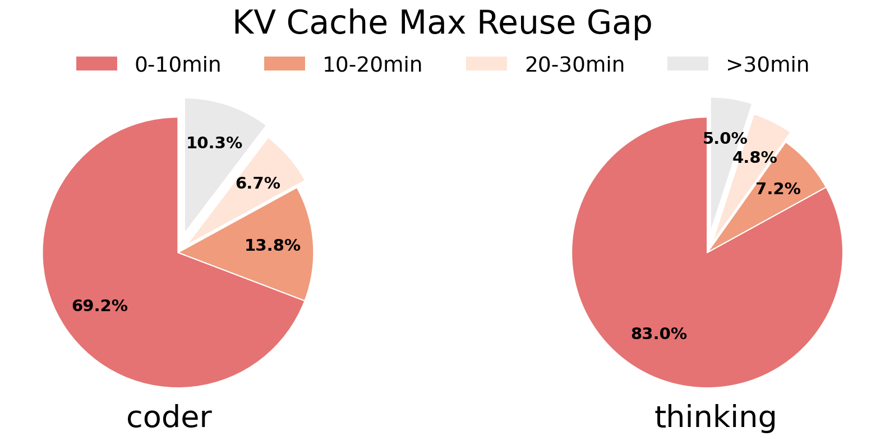
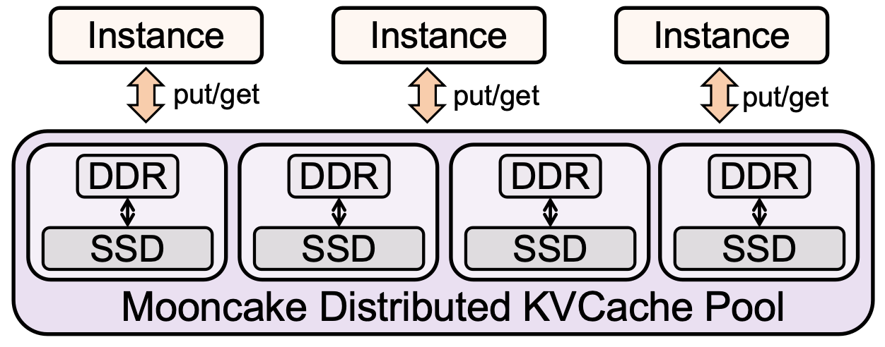
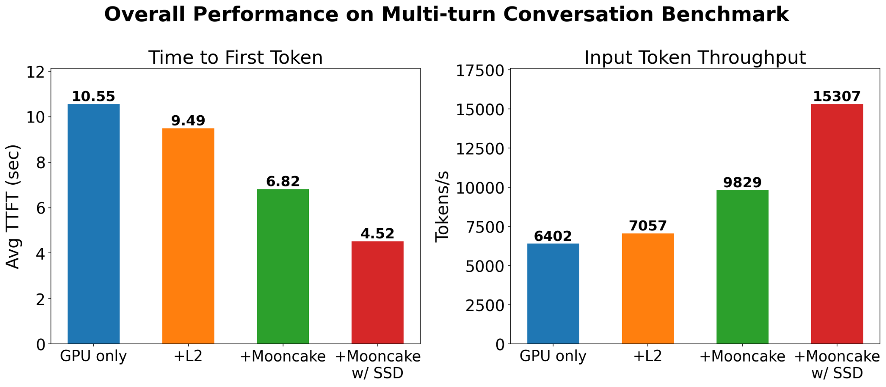
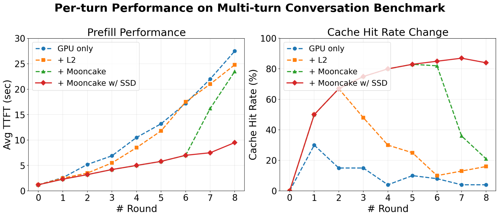

## SSD Offloading Becomes Necessary, Practical and Profitable

The rise of agentic workloads fundamentally changes the role of KV cache. Coding assistants, multi-turn reasoning, and tool-using agents repeatedly reuse long context prefixes while appending only a small number of new tokens at each interaction. Tool invocations can easily span tens or even hundreds of rounds, pushing context lengths to hundreds of thousands of tokens. This creates both a tremendous opportunity and a serious challenge: when KV cache is effectively retained, cache hit rates can exceed 95%; but once a cache miss occurs, the system may have to recompute hundreds of thousands of tokens, incurring substantial prefill overhead.

However, the lifetimes of KV caches vary dramatically; some will be reused hours or even longer later. Retaining all KV caches in expensive HBM or DRAM is therefore both inefficient and economically unsustainable. To quantify this, we analyzed production traces from [Qwen-Bailian](https://github.com/alibaba-edu/qwen-bailian-usagetraces-anon). This dataset consists of a two-hour sampled and anonymized KV cache trace from a single Qwen model-serving cluster on Aliyun Bailian. For our analysis, we select two representative traces: reasoning-intensive chat (thinking) and code generation (coder).

As shown in the figure, KV block reuse exhibits pronounced temporal-locality polarization, while block lifetimes span orders of magnitude. In coding scenarios, 69.2% of reused blocks are re-accessed within ten minutes, whereas cold reuse after more than 30 minutes accounts for only 10.3%. In reasoning scenarios, this skew is even more extreme: 83.0% of reused blocks exhibit short-cycle reuse, while only 5.0% fall into the cold-reuse category. These distributions show that KV cache access does not follow a simple monotonic decay. Instead, it forms a bimodal pattern where hot clusters coexist with cold tails. As a result, LRU or fixed-TTL policies may prematurely evict cold yet still valuable KV blocks, leading to catastrophic cache misses and massive prefill recomputation later.

This naturally raises a question: can we use cheaper, more cost-effective SSDs to store these long-tail KV blocks? In our previous blog, [How Much KV Cache Budget Do We Need for LLM Serving?](/blog/calculate-kvcache-cache-budge/), we answered this question through a quantitative analysis of agentic workloads. We showed that the marginal benefit of provisioning additional DRAM capacity quickly diminishes, making a tiered storage hierarchy increasingly attractive. More importantly, because the vast majority of KV cache hits can already be served by a relatively small DRAM cache, only a tiny fraction of requests need to access the SSD tier. In other words, SSDs can dramatically expand KV cache capacity while imposing very little pressure on the read path.

Even more appealingly, KV cache hit rate translates nonlinearly into prefill speedup: if the hit rate is $r$, only $1-r$ of prefill computation needs to be recomputed, yielding an ideal speedup of $\frac{1}{1-r}$. As agentic workloads often operate in a high-hit-rate regime, even a small improvement in long-tail KV cache hits can translate into a disproportionately large gain in prefill performance.

## Mooncake Solution: A Distributed SSD Pool for KV Cache

Motivated by this observation, we built SSD offloading support directly into Mooncake Store. As shown in the figure below, Mooncake organizes local SSDs across serving nodes into a distributed KV cache pool, just as it already does for DRAM. DRAM remains the low-latency serving tier for hot data, while the larger, lower-cost SSD tier extends KV cache lifetime. A master coordinates the global metadata of all replicas across both tiers, allowing any compute node to transparently discover and reuse KV blocks stored on another node’s local SSD.

### Data Flow

Mooncake keeps SSD access off the application’s critical write path and moves data asynchronously between the DRAM and SSD tiers. The complete flow consists of four operations: offloading KV blocks to SSD, loading them on demand, promoting frequently reused blocks back to DRAM, and recovering SSD metadata after restarts.

**Offloading:** SSD offloading is completely asynchronous and never blocks the application write path. Newly generated KV cache is first stored in DRAM and immediately becomes available for serving. Background heartbeat messages periodically synchronize with the master, which decides which objects should be offloaded based on the configured policy. The local node then batches the selected KV blocks and flushes them to its local SSD. Mooncake currently supports two offloading policies: eager offloading, which continuously flushes newly created KV cache in the background, and watermark-based eviction, which only starts offloading when DRAM utilization exceeds a configurable threshold.

**Loading and Promotion:** When a requested KV block is no longer available in DRAM, the requester first queries the master for the location of its SSD replica. The target node reads the data from its local SSD into a temporary DRAM buffer, after which the requester pulls the data directly through RDMA or TCP. To avoid repeatedly paying SSD access latency, the master continuously tracks access patterns of SSD-resident objects. Frequently accessed KV blocks are proactively promoted back into DRAM, allowing subsequent requests to be served entirely from the memory tier.

**Metadata Recovery:** SSD-resident KV blocks persist across storage-service and master restarts, but their locations must be restored to the master before the blocks can be reused. Mooncake delegates this recovery process to individual storage nodes. When a node starts, it scans its local on-disk metadata and re-registers every valid object with the master, making the recovered SSD replicas globally discoverable once again.

### Optimizing the SSD Data Path

Simply adding an SSD tier is not enough. The storage stack itself must sustain high throughput under the highly concurrent access patterns of LLM serving. Mooncake therefore optimizes the entire SSD data path to minimize software overhead and keep modern NVMe devices fully utilized.

When `MOONCAKE_OFFLOAD_USE_URING` is enabled, Mooncake switches from POSIX I/O to an io_uring-based implementation. Instead of sharing a global ring, each thread owns a private io_uring instance, eliminating lock contention and allowing I/O to scale with concurrency.

This per-thread design also enables batching multiple read requests into a single submission, increasing queue depth and better utilizing NVMe parallelism. In addition, the staging buffer is registered as a fixed buffer with io_uring, avoiding repeated buffer registration on every I/O.

Within the io_uring path, `O_DIRECT` can optionally be enabled to bypass the page cache. Mooncake transparently handles unaligned requests with temporary aligned buffers, so users do not need to manage 4 KB alignment themselves.

### Pluggable Storage Backends

A storage backend defines how objects are organized on disk, including their layout, indexing, allocation, and eviction strategy. Since different workloads prioritize different trade-offs, such as throughput and eviction granularity, Mooncake Store provides a pluggable backend interface with three built-in implementations:

- **BucketStorageBackend** (default) groups objects into buckets before flushing them to disk. Each bucket consists of a data file and a metadata index, written once the bucket reaches a size or key threshold. Fixed-size slots ensure sequential reads and writes, delivering higher SSD throughput. Bucket-level FIFO and LRU eviction policies are currently supported.
- **OffsetAllocatorStorageBackend** stores all objects in a single pre-allocated file. Like Mooncake's DRAM storage, it uses an OffsetAllocator to manage space, enabling object-level allocation and eviction.
- **FilePerKeyBackend** (demo) stores each object as an individual file under a two-level hash-sharded directory tree. While not designed for performance, it is useful for debugging and inspecting on-disk data.

## Benchmark Results

We evaluate end-to-end performance on a single DGX node equipped with 8 × A100-SXM4-40GB GPUs and dual RDMA NICs. The evaluation compares four configurations:

- **GPU only:** KV cache is stored only in GPU memory.
- **HiCache L1 + L2:** KV cache is stored across both device and host memory.
- **HiCache L1 + L2 + Mooncake:** KV cache is stored across device memory, host memory, and Mooncake DRAM.
- **HiCache L1 + L2 + Mooncake with SSD:** KV cache is stored across device memory, host memory, and Mooncake DRAM plus SSD.

As shown in the figure above, SSD offloading significantly reduces TTFT while improving prefill throughput.

To understand where these gains come from, we break down TTFT and KV cache hit rate by conversation round, with the output length fixed to one token to isolate prefill latency. During the first six rounds, the memory pool is sufficient for both configurations, and they achieve nearly identical hit rates above 80%. The difference emerges once memory is exhausted. Starting from round 7, Mooncake without SSD must evict KV cache, causing the hit rate to collapse from 83% to 36% and TTFT to increase from 6 s to 16 s. With SSD offloading, evicted KV blocks remain available on NVMe, keeping the hit rate above 84% through round 8 and limiting TTFT to 9.4 s.

## Ongoing Work

Mooncake's SSD offloading support is only the first step toward a fully tiered KV cache architecture. We are actively exploring three major extensions:

**GPU Direct Storage (GDS).** Currently, SSD offloading still stages data through DRAM when moving KV cache between SSDs and GPU memory. GDS removes this intermediate hop, enabling KV cache to be transferred directly between NVMe SSDs and GPU HBM. This reduces both data movement overhead and end-to-end latency.

**Distributed Storage Backends.** While local NVMe pooling is easy to deploy and operate, many users already have mature distributed storage systems they prefer to reuse. To support both models, Mooncake is introducing a pluggable backend interface for distributed storage systems, with 3FS planned as the first integration.

**NVMe-oF Integration.** While the current SSD tier is built on local NVMe devices, we are also exploring NVMe over Fabrics (NVMe-oF) to extend the same abstraction across remote storage. By integrating NVMe-oF with Mooncake's Transfer Engine, remote NVMe devices can be accessed with the same high-performance data path as local SSDs, enabling storage resources to be pooled across machines without sacrificing efficiency.

## Acknowledgment

We would like to thank everyone in the community who has contributed to or supported this work. In particular, we are grateful to:

- Approaching.AI: Jiahao Lu, Zuoyuan Zhang, Chizheng Fang, Ke Yang
- Ant Group: Xinjie Zhu, Yongke Zhao, Yue Wan, Tingwei Huang
- NVIDIA: Mahesh Bapatu
- Alibaba Cloud: Xinpeng Zhao, Bo Gao, Xuchun Shang, Teng Ma

## Related Links

- Mooncake project: https://github.com/kvcache-ai/Mooncake
- Documentation: https://kvcache-ai.github.io/Mooncake/design/ssd-offload.html
- Usage: https://kvcache-ai.github.io/Mooncake/deployment/ssd-offload.html
